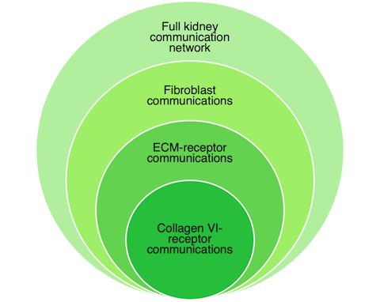

## MatriCom Case Study: communication networks of the kidney matrisome
All steps discussed below are included in a **single script**: [kidney.R](kidney.R).

To demonstrate how MatriCom can be used to interrogate biological systems, we performed a case study of matrisome communication networks in the human kidney using the *Kidney ([Stewart et al., Science 2019](https://www.science.org/doi/10.1126/science.aat5031))* open-access dataset from the [Azimuth](https://azimuth.hubmapconsortium.org/references/#Human%20-%20Kidney) app collection (HuBMAP). The sample was processed with MatriCom using original sample annotations and all default query parameters and filters.

The workflow is divided into a preparation step, followed by a four-part case study (Figure 1):
* **[Part 0 - Build reference lists](#build-reference-lists):** glossary of harmonized cell type labels and ECM-receptor gene pairs lists
* **[Part 1 - Full kidney communication network](#case-study-part-1):** all communication pairs detected by default MatriCom analysis
* **[Part 2 - Fibroblast communications](#case-study-part-2):** subset of communication pairs established by fibroblasts and their partners
* **[Part 3 - ECM-receptor communications](#case-study-part-3):** subset of communication pairs that represent experimentally validated ECM-receptor interactions, where 'ligands' are matrisome genes expressed by fibroblasts
* **[Part 4 - Collagen VI-receptor communications](#case-study-part-4):** subset of communication pairs that consist of fibroblast-expressed collagen VI genes and their receptors

  
*Figure 1. Kidney case study workflow.*

### Required Libraries
```R
library("tidyr")
library("dplyr")
library("Seurat")
library("BiocManager")
library("clusterProfiler")
library("dplyr")
library("igraph")
library("KEGGgraph")
library("org.Hs.eg.db") 
library("CellChat")
library("data.table")
library("gsheet")
library("pathview")
library("readxl")
```

### Set-up
Set working directory (work dir) to desired file path, such as the current folder, for example. All files downloaded or created by the script will appear in one of the three folders specified after it. Checksums for downloaded files can be found in [md5sum.txt](./md5sum.txt).
```R
work.d <- setwd(".")
dln.d <- paste0(work.d, "/", "downloaded")
ref.d <- paste0(work.d, "/", "reference-lists")
out.d <- paste0(work.d, "/", "results-output")
```
Downloads time out. Because some of the downloads are quite large, we recommend specifying a longer timeout. This will increase it to 30 min:
```R
options(timeout=1800)
```

### BUILD REFERENCE LISTS
**Prepare Azimuth metadata for full kidney dataset:** To retrieve metadata for the original scRNA-seq dataset, download the *Human - Kidney* Seurat object from the Azimuth reference tissue library: [Demo Dataset(s): Stewart et al., Science 2019](https://azimuth.hubmapconsortium.org/references/#Human%20-%20Kidney).
The full Azimuth metadata table can be extracted **automatically** as follows:
```R
# Download
www <- "https://seurat.nygenome.org/azimuth/demo_datasets/kidney_demo_stewart.rds"
download.file(www, paste0(dln.d, "/", "kidney_demo_stewart.rds"))

meta <- readRDS(paste0(dln.d, "/", "kidney_demo_stewart.rds"))
meta <- data.frame(meta@meta.data)

# Save metadata in folder "reference-lists"
write.csv(meta, paste0(ref.d, "/", "Azimuth kidney_demo_Seurat metadata.csv"))
```
**Process kidney dataset with MatriCom and prepare glossary of cell type labels:** To count cells/expressions/communications per population, we must harmonize the format of population names across data sources (e.g. original annotations from MatriCom vs cell types from Azimuth metadata).

First, go to MatriCom (https://matrinet.shinyapps.io/matricom/) to import the kidney dataset in one of two ways:
* Use *Data Input* > *Option 1*
  * Upload `downloads/kidney_demo_stewart.rds`.
  * Go to *Query Parameters* > *Select cell identity labels* > *celltype*  
*OR*
* Use *Data Input* > *Option 2*
  * Select *Collection* > *Other open access datasets*
  * Select *Dataset* > *Kidney (Stewart et al., Science 2019)*  

Save the file as `HKid_default_MatriCom network.XLSX` in same location as the `kidney.R` script (i.e. current work dir). **For user convenience, we provide the file.** 
Import the kidney communication network from MatriCom and prepare glossary as follows:

```R
kidney <- as.data.frame(read_excel("HKid_default_MatriCom network.XLSX", sheet = "communication network"))
gloss <- data.frame(kid = sort(unique(kidney$Population1)), meta = sort(unique(meta$celltype)))
write.csv(gloss, paste0(ref.d, "/", "HuBMAP kidney_base lookup table.csv"))
```
**Prepare gene pairs from KEGG ECM-receptor interaction pathway:** To identify ECM-receptor communication pairs in MatriCom output, import the *ECM-receptor interaction* pathway map([hsa04512](https://www.kegg.jp/pathway/hsa04512) from KEGG and extract gene pairs. Note that the directionality column in ECM-receptor reference list is used to designate the ligand or receptor gene and, likewise, the sender or receiver population within each pair returned by MatriCom.
```R
# Download
download.kegg(pathway.id = "04512", species = "hsa", kegg.dir = dln.d, file.type = "xml")

kg <- parseKGML2DataFrame(paste0(dln.d, "/", "hsa04512.xml"))
kg$from <- gsub("hsa:","",kg$from)
kg$to <- gsub("hsa:","",kg$to)
kg$order <- c(1:nrow(kg))

kg.1 <- bitr(kg$from, fromType="ENTREZID", toType="SYMBOL", OrgDb="org.Hs.eg.db")
kg <- distinct(merge(kg,kg.1,by.x="from",by.y="ENTREZID"))
kg.1 <- bitr(kg$to, fromType="ENTREZID", toType="SYMBOL", OrgDb="org.Hs.eg.db")
kg <- distinct(merge(kg,kg.1,by.x="to",by.y="ENTREZID"))
kg <- distinct(kg[,c(6:7)])
colnames(kg) <- c("Gene1","Gene2")
kg$Gene1_Gene2 <- paste0(kg$Gene1, "_", kg$Gene2)

# 536 directional interactions
dim(kg)

kg$dir <- "LR"
kg.1 <- data.frame(Gene1 = kg$Gene2, Gene2 = kg$Gene1, Gene1_Gene2 = paste0(kg$Gene2,"_", kg$Gene1), dir = "RL")
kg <- rbind(kg, kg.1)

# 1072 non-directional interactions
dim(kg)

# Save interactions
write.csv(kg, paste0(ref.d, "/", "KEGG-hsa04512_LR-RL.csv"), row.names=F)
```

Subset with only interactions involving non-integrin cell surface receptors:
```R
# Cell surface interactions (non-integrin)
kg_surf <- kg[grepl("ITG",kg$Gene1_Gene2)!=T,]
dim(kg_surf) #330 interactions 

# Save non-integrin interactions
write.csv(kg_surf, paste0(ref.d, "/", "KEGG-hsa04512_surf.csv"), row.names=F)
```
Subset with only interactions involving integrin receptors, represented as alpha-beta subunit gene pairs:
```R
# Integrin interactions
db <- subsetDB(CellChatDB=CellChatDB.human, search="ECM-Receptor", key="annotation")
db1 <- bind_rows(db[1])
db1 <- db1[db1$evidence=="KEGG: hsa04512",]
kg_itg <- data.frame(Ligand = db1$ligand, Receptor = db1$receptor, X = db1$receptor)
kg_itg$Receptor <- gsub("_", "-", kg_itg$Receptor)
kg_itg <- separate_wider_delim(kg_itg, cols=3, delim="_", names=c("ReceptorA", "ReceptorB"), too_few="align_start")
kg_itg$Ligand_Receptor <- paste0(kg_itg$Ligand,"_",kg_itg$Receptor)
dim(kg_itg) #421 interactions

# Save integrin interactions
write.csv(kg_itg, paste0(ref.d, "/", "KEGG-hsa04512_ITG.csv"), row.names=F)
```

---

### CASE STUDY PART 1
**Prepare matrisome gene list [0]:** To prepare the set of human and mouse matrisome gene symbols, also used to construct MatriComDB, annotated lists of human and mouse matrisome genes were downloaded from The Matrisome Project website: 
* Human
  * URL: https://sites.google.com/uic.edu/matrisome/matrisome-annotations/homo-sapiens
  * Google sheet: *Download the complete Homo sapiens matrisome list (rev. 2014)* > save as an XLSX file
* Mouse
  * URL: https://sites.google.com/uic.edu/matrisome/matrisome-annotations/mus-musculus
  * Google sheet: *Download the complete Mus musculus matrisome list (rev. 2014)* > save as an XLSX file
We combined the human and mouse lists and filtered for only unique entries, keeping matrisome division and category columns:
```R
# Obtain the sheets directly from upstream
hs <- as.data.frame(gsheet2tbl("https://docs.google.com/spreadsheets/d/1GwwV3pFvsp7DKBbCgr8kLpf8Eh_xV8ks/edit?usp=sharing&ouid=102352631360008021621&rtpof=true&sd=true", sheetid = "Hs_Matrisome_Masterlist"))
mm <- as.data.frame(gsheet2tbl("https://docs.google.com/spreadsheets/d/1Te6n2q_cisXeirzBClK-VzA6T-zioOB5/edit?usp=sharing&ouid=102352631360008021621&rtpof=true&sd=true", sheetid = "Mm_Matrisome_Masterlist"))

hs <- hs[, c(1:3)]
mm <- mm[, c(1:3)]
mm[, 3] <- toupper(mm[, 3])
m.list <- rbind(hs, mm)
m.list <- unique(m.list)
colnames(m.list) <- c("Division", "Category", "Gene_Symbol")
write.csv(m.list, paste0(out.d, "/", "MATRISOME_Hs-Mm_masterlist.csv"), quote = F, row.names = F)
```

After importing the default MatriCom communication network table, we add columns for population and gene pair labels, including matrisome divisions and categories [1]. We identify individual kidney cell populations and find the contribution of expressions per population [2], relative to population size in the original sample scRNA-seq dataset from Azimuth. Here, we define *expressions* as the number of times a given population appears in any communication in the MatriCom output table.
```R
kidney$Population1 <- apply(kidney, 1, function(x){
  r <- match(x[1], gloss$kid)
  return(gloss$meta[r])
})
kidney$Population2 <- apply(kidney, 1, function(x){
  r <- match(x[5], gloss$kid)
  return(gloss$meta[r])
})

kidney$Pair <- paste0(kidney$Population1, "_", kidney$Population2)
kidney$Div1_Div2 <- paste0(kidney$Matrisome.Division.Gene1, "_", kidney$Matrisome.Division.Gene2)
kidney$Cat1_Cat2 <- paste0(kidney$Matrisome.Category.Gene1, "_", kidney$Matrisome.Category.Gene2)
kidney$Pair.type <- ifelse(kidney$Population1==kidney$Population2, "Homocellular", "Heterocellular")

# Save divisions and categories
write.csv(kidney, paste0(out.d, "/", "HKid_default_Div-Cat.csv"), row.names = F) 

# Population Contribution
pops <- data.frame(Population = gloss$meta)

# Number of times each population appears in matricom output table as pop1 or pop2
for(i in 1:nrow(pops)){
  x <- meta[pops$Population[i]==meta$celltype,]
  pops$n.Pop[i] <- nrow(x)
  x1 <- kidney[pops$Population[i]==kidney$Population1,]
  x2 <- kidney[pops$Population[i]==kidney$Population2,]
  x3 <- rbind(x1, x2)
  pops$n.Expr[i] <- nrow(x3)
}

N.Pop <- sum(pops$n.Pop)
N.Expr <- sum(pops$n.Expr) # = 2*N.Itxns

pops$freq.Pop <- pops$n.Pop/N.Pop
pops$freq.Expr <- pops$n.Expr/N.Expr 
pops$ctrb.Expr <- pops$freq.Expr / pops$freq.Pop

write.csv(pops, paste0(out.d, "/", "HKid_default_Pop Contrib.csv"), row.names = F)
```
This section will produce the following results in `results-output/`:
* [0] `MATRISOME_Hs-Mm_masterlist.csv`
* [1] `HKid_default_Div-Cat.csv`
* [2] `HKid_default_Pop Contrib.csv`

---

### CASE STUDY PART 2
Next, we take a subset of communications from the full network in which fibroblasts are one of the communicating populations [3] and find the frequency of each population pair. We then determine the contribution of communications per partner population to the full fibroblast network [4], the fibroblast Matrisome-Matrisome communication network [5], and the fibroblast Matrisome-Non.matrisome communication network [6], relative to the size of both populations in the original sample scRNA-seq dataset.

```R
# Fibroblast Partner Contribution
fib <- kidney[kidney$Population1=="Fibroblast" | kidney$Population2=="Fibroblast",]
write.csv(fib, paste0(out.d, "/", "HKid_default_Div-Cat_Fib.csv"), row.names=F)

hom <- fib[fib$Pair.type=="Homocellular",]
het <- fib[fib$Pair.type=="Heterocellular",]

part <- data.frame(Partner = unique(fib$Population1), n.Pop = 0, #same as pairs table where Pop1 = Fib
                   n.Comm = 0, n.MXMX = 0, n.NMX = 0, n.CC = 0, n.AA = 0, n.CA = 0, n.CN = 0, n.AN = 0) 
part <- part[order(part$Partner),]

for(i in 1:nrow(part)){
  x <- meta[part$Partner[i]==meta$celltype,]
  part$n.Pop[i] <- nrow(x)
  if(part$Partner[i]=="Fibroblast"){
    x3 <- hom
  } else {
    x1 <- het[het$Population1==part$Partner[i],]
    x2 <- het[het$Population2==part$Partner[i],]
    x3 <- rbind(x1, x2)
  }
  part$n.Comm[i] <- nrow(x3)  
  part$n.MXMX[i] <- sum(grepl("Matrisome-Matrisome", x3$Type.of.communication))
  part$n.NMX[i] <- sum(grepl("Non.matrisome-Matrisome", x3$Type.of.communication))
  part$n.CC[i] <- sum(grepl("Core matrisome_Core matrisome", x3$Div1_Div2))
  part$n.AA[i] <- sum(grepl("Matrisome-associated_Matrisome-associated", x3$Div1_Div2))
  part$n.CA[i] <- sum(sum(grepl("Core matrisome_Matrisome-associated", x3$Div1_Div2)), sum(grepl("Matrisome-associated_Core matrisome", x3$Div1_Div2)))
  part$n.CN[i] <- sum(sum(grepl("Core matrisome_Non.matrisome", x3$Div1_Div2)), sum(grepl("Non.matrisome_Core matrisome", x3$Div1_Div2)))
  part$n.AN[i] <- sum(sum(grepl("Matrisome-associated_Non.matrisome", x3$Div1_Div2)), sum(grepl("Non.matrisome_Matrisome-associated", x3$Div1_Div2)))
}

N.Pop <- sum(part$n.Pop)
N.Comm <- sum(part$n.Comm)

part$p.MXMX <- part$n.MXMX / part$n.Comm
part$p.NMX <- part$n.NMX / part$n.Comm
part$p.CC <- part$n.CC / part$n.Comm
part$p.AA <- part$n.AA / part$n.Comm
part$p.CA <- part$n.CA / part$n.Comm
part$p.CN <- part$n.CN / part$n.Comm
part$p.AN <- part$n.AN / part$n.Comm

part$freq.Pop <- part$n.Pop / N.Pop
part$freq.Fib <- part$freq.Pop[part$Partner=="Fibroblast"]
part$freq.Comm <- part$n.Comm / N.Comm
part$ctrb.Comm <- (part$freq.Comm / part$freq.Pop) + (part$freq.Comm / part$freq.Fib)

part$ctrb_p.MXMX <- part$ctrb.Comm * part$p.MXMX
part$ctrb_p.NMX <- part$ctrb.Comm * part$p.NMX

part$ctrb_p.CC <- part$p.CC * part$ctrb.Comm
part$ctrb_p.AA <- part$p.AA * part$ctrb.Comm
part$ctrb_p.CA <- part$p.CA * part$ctrb.Comm
part$ctrb_p.CN <- part$p.CN * part$ctrb.Comm
part$ctrb_p.AN <- part$p.AN * part$ctrb.Comm

write.csv(part, paste0(out.d, "/", "HKid_default_Fib Pair Contrib.csv"), row.names=F)

# Network: Matrisome-Matrisome only
fib.mxmx <- fib[fib$Type.of.communication=="Matrisome-Matrisome",]

mxmx <- data.frame(Partner = part$Partner, n.Pop = part$n.Pop, n.MXMX = part$n.MXMX, 
                   n.CC = part$n.CC, n.AA = part$n.AA, n.CA = part$n.CA)

mxmx$pp.CC <- mxmx$n.CC / mxmx$n.MXMX
mxmx$pp.AA <- mxmx$n.AA / mxmx$n.MXMX
mxmx$pp.CA <- mxmx$n.CA / mxmx$n.MXMX

mxmx$freq.Pop <- part$freq.Pop
mxmx$freq.Fib <- part$freq.Pop[part$Partner=="Fibroblast"]
mxmx$freq.MXMX <- part$n.MXMX / sum(part$n.MXMX)
mxmx$ctrb.MXMX <- (mxmx$freq.MXMX/mxmx$freq.Fib) + (mxmx$freq.MXMX/mxmx$freq.Pop) #contrib. to only Matrisome-Matrisome network

mxmx$ctrb_pp.CC <- mxmx$pp.CC * mxmx$ctrb.MXMX
mxmx$ctrb_pp.AA <- mxmx$pp.AA * mxmx$ctrb.MXMX
mxmx$ctrb_pp.CA <- mxmx$pp.CA * mxmx$ctrb.MXMX

write.csv(mxmx, paste0(out.d, "/", "HKid_default_Fib Pair Contrib_MXMX.csv"), row.names=F) #Supplementary Table S4D

# Network: Non.Matrisome-Matrisome only
fib.nmx <- fib[fib$Type.of.communication=="Non.matrisome-Matrisome",]

nmx <- data.frame(Partner = part$Partner, n.Pop = part$n.Pop, 
                  n.NMX = part$n.NMX, n.CN = part$n.CN, n.AN = part$n.AN)

nmx$pp.CN <- nmx$n.CN / nmx$n.NMX
nmx$pp.AN <- nmx$n.AN / nmx$n.NMX

nmx$freq.Pop <- part$freq.Pop
nmx$freq.Fib <- part$freq.Pop[part$Partner=="Fibroblast"]
nmx$freq.NMX <- part$n.NMX / sum(part$n.NMX)

nmx$ctrb.NMX <- (nmx$freq.NMX/nmx$freq.Fib) + (nmx$freq.NMX/nmx$freq.Pop) #contrib. to only Non.Matrisome-Matrisome network
nmx$ctrb_pp.CN <- nmx$pp.CN * nmx$ctrb.NMX
nmx$ctrb_pp.AN <- nmx$pp.AN * nmx$ctrb.NMX

write.csv(nmx, paste0(out.d, "/", "HKid_default_Fib Pair Contrib_NMX.csv"), row.names=F)
```
This section will produce the following results in `results-output/`:
* [3] `HKid_default_Div-Cat_Fib.csv`
* [4] `HKid_default_Fib Pair Contrib.csv`
* [5] `HKid_default_Fib Pair Contrib_MXMX.csv`
* [6] `HKid_default_Fib Pair Contrib_NMX.csv`

---

### CASE STUDY PART 3
Next, we take a subset of communications which represent an ECM-receptor gene pair where fibroblasts are the sender population [7]. We identify unique ligand and receptor genes [8,9] and find the contribution of communications per receiver population to the fibroblast ECM-receptor network [10], relative to the size of both populations in the original sample scRNA-seq dataset.
```R
# Fibroblast ECM-Receptors

# Subset: only ECM-R
fib$Gene1_Gene2 <- paste0(fib$Gene1,"_",fib$Gene2)
fib$check <- apply(fib, 1, function(x){
  ifelse(x[21] %in% kg$Gene1_Gene2, "Y", "N")
})

ecmr <- fib[fib$check=="Y",1:22]

ecmr$dir <- apply(ecmr, 1, function(x){
  r <- which(kg$Gene1_Gene2 == x[21])
  ifelse(kg$dir[r]=="LR", "LR", "RL")
})

for(i in 1:nrow(ecmr)){
  if(ecmr$dir[i]=="LR"){
    ecmr$Ligand[i] <- ecmr$Gene1[i]
    ecmr$Receptor[i] <- ecmr$Gene2[i]
    ecmr$Sender[i] <- ecmr$Population1[i]
    ecmr$Receiver[i] <- ecmr$Population2[i]
    ecmr$DivL[i] <- ecmr$Matrisome.Division.Gene1[i]
    ecmr$DivR[i] <- ecmr$Matrisome.Division.Gene2[i]
    ecmr$CatL[i] <- ecmr$Matrisome.Category.Gene1[i]
    ecmr$CatR[i] <- ecmr$Matrisome.Category.Gene2[i]
    ecmr$DivL_DivR[i] <- ecmr$Div1_Div2[i]
    ecmr$CatL_CatR[i] <- ecmr$Cat1_Cat2[i]
  }else{
    ecmr$Ligand[i] <- ecmr$Gene2[i]
    ecmr$Receptor[i] <- ecmr$Gene1[i]
    ecmr$Sender[i] <- ecmr$Population2[i]
    ecmr$Receiver[i] <- ecmr$Population1[i]
    ecmr$DivL[i] <- ecmr$Matrisome.Division.Gene2[i]
    ecmr$DivR[i] <- ecmr$Matrisome.Division.Gene1[i]
    ecmr$CatL[i] <- ecmr$Matrisome.Category.Gene2[i]
    ecmr$CatR[i] <- ecmr$Matrisome.Category.Gene1[i]
    ecmr$DivL_DivR[i] <- paste0(ecmr$Div2[i],"_",ecmr$Div1[i])
    ecmr$CatL_CatR[i] <- paste0(ecmr$Cat2[i],"_",ecmr$Cat1[i])
  }
}
dim(ecmr) #470 communications

# Subset: Sender = Fibroblast
ecmr.fib <- ecmr[ecmr$Sender=="Fibroblast",] 
write.csv(ecmr.fib, paste0(out.d, "/", "HKid_default_Div-Cat_Fib ECM-R.csv"), row.names = F) #Supplementary Table S5A

# Gene lists
lig <- data.frame(Gene = unique(ecmr.fib$Ligand), Class = "Ligand")
rcpt <- data.frame(Gene = unique(ecmr.fib$Receptor), Class = "Receptor")

# Ligands
lig$Div <- "Non-matrisome"; lig$Cat <- "Non-matrisome"; lig$n.Expr <- 0; lig$freq.Expr <- 0; 
for(i in 1:nrow(lig)){
  lig$n.Expr[i] <- sum(grepl(lig$Gene[i], ecmr.fib$Ligand))
  for(j in 1:nrow(m.list)){
    if(lig$Gene[i] %in% m.list$Gene_Symbol[j]){
      lig$Div[i] <- m.list$Division[j]
      lig$Cat[i] <- m.list$Category[j]
    } else{next}
  }
}
lig$freq.Expr<- lig$n.Expr / sum(lig$n.Expr)
write.csv(lig, paste0(out.d, "/", "HKid_default_Fib Ligands.csv"), row.names=F) #Supplementary Table S5B

# Receptors
rcpt$Div <- "Non-matrisome"; rcpt$Cat <- "Non-matrisome"; rcpt$n.Expr <- 0; rcpt$freq.Expr <- 0; 
for(i in 1:nrow(rcpt)){
  rcpt$n.Expr[i] <- sum(grepl(rcpt$Gene[i], ecmr.fib$Receptor))
  for(j in 1:nrow(m.list)){
    if(rcpt$Gene[i] %in% m.list$Gene_Symbol[j]){
      rcpt$Div[i] <- m.list$Division[j]
      rcpt$Cat[i] <- m.list$Category[j]
    } else{next}
  }
}
rcpt$freq.Expr<- rcpt$n.Expr / sum(rcpt$n.Expr)
write.csv(rcpt, paste0(out.d, "/", "HKid_default_Fib Receptors.csv"), row.names=F) #Supplementary Table S5B

# Receiver Contribution
recv <- data.frame(Receiver = sort(unique(ecmr.fib$Receiver)))

recv$n.Comm <- 0
recv$n.Glyco_Aff <- 0; recv$n.Glyco_Non <- 0
recv$n.Col_Aff <- 0; recv$n.Col_Non <- 0
for(i in 1:nrow(recv)){
  x <- ecmr.fib[recv$Receiver[i]==ecmr.fib$Receiver,]
  recv$n.Comm[i] <- nrow(x)
  recv$n.Glyco_Aff[i] <- sum(grepl("ECM glycoproteins_ECM-affiliated proteins", x$CatL_CatR))
  recv$n.Glyco_Non[i] <- sum(grepl("ECM glycoproteins_Non.matrisome", x$CatL_CatR))
  recv$n.Col_Aff[i] <- sum(grepl("Collagens_ECM-affiliated proteins", x$CatL_CatR))
  recv$n.Col_Non[i] <- sum(grepl("Collagens_Non.matrisome", x$CatL_CatR))
}
N.Comm <- sum(recv$n.Comm)

recv$p.Glyco_Aff <- recv$n.Glyco_Aff / recv$n.Comm
recv$p.Glyco_Non <- recv$n.Glyco_Non / recv$n.Comm
recv$p.Col_Aff <- recv$n.Col_Aff / recv$n.Comm
recv$p.Col_Non <- recv$n.Col_Non / recv$n.Comm

# Contribution
pops <- pops[,-c(4,6:7)]

recv$n.Send <-pops$n.Pop[10]
recv$n.Recv <- apply(recv, 1, function(x){
  r <- match(x[1], pops$Population)
  return(pops$n.Pop[r])
})

N.Pop <- sum(recv$n.Recv)
recv$freq.Send <- recv$n.Send / N.Pop
recv$freq.Recv <- recv$n.Recv / N.Pop

recv$freq.Comm <- recv$n.Comm / N.Comm
recv$ctrb.Comm <- (recv$freq.Comm/recv$freq.Send) + (recv$freq.Comm/recv$freq.Recv)
recv$ctrb_p.Glyco_Aff <- recv$ctrb.Comm * recv$p.Glyco_Aff
recv$ctrb_p.Glyco_Non <- recv$ctrb.Comm * recv$p.Glyco_Non
recv$ctrb_p.Col_Aff <- recv$ctrb.Comm * recv$p.Col_Aff
recv$ctrb_p.Col_Non <- recv$ctrb.Comm * recv$p.Col_Non

write.csv(recv, paste0(out.d, "/", "HKid_default_Fib Receiver Contrib.csv"), row.names = F)
```
This section will produce the following results in `results-output/`:
* [7] `HKid_default_Div-Cat_Fib ECM-R.csv`
* [8] `HKid_default_Fib Ligands.csv`
* [9] `HKid_default_Fib Receptors.csv`
* [10] `HKid_default_Fib Receiver Contrib.csv`

---

### CASE STUDY PART 4
Finally, we evaluate the degree to which known collagen VI-receptor interactions (from KEGG) are recapitulated by communications returned from transcriptomic-level MatriCom analysis. Taking a subset of communications in which fibroblasts express one of the three genes - *COL6A1*, *COL6A2*, and *COL6A3* - which encode the [a1(VI)a2(VI)a3(VI)] trimer [11], we identify receiver populations and extrapolated distinct collagen VI-cell surface receptor interactions [12]. Next, we identify receiver populations that express pairs of *ITGA* and *ITGB* genes which are known to form integrin heterodimers and extrapolated distinct collagen VI-integrin receptor complexes. [13,14]. 

```R
# Fibroblast Collagen Type VI
c6 <- ecmr.fib[grepl("COL6A1", ecmr.fib$Gene1_Gene2)==T | 
                 grepl("COL6A2", ecmr.fib$Gene1_Gene2)==T | 
                 grepl("COL6A3", ecmr.fib$Gene1_Gene2)==T,]

write.csv(c6, paste0(out.d, "/", "HKid_default_Div-Cat_Fib ECM-R_COL6.csv"), row.names=F)

# Cell surface
kg_surf <- kg[grepl("ITG", kg$Gene1_Gene2)!=T,]

# KEGG COL6 list subset: non-integrin receptor genes only
kg_surf.c6 <- kg_surf[grepl("COL6A1", kg_surf$Gene1_Gene2)==T | 
                        grepl("COL6A2", kg_surf$Gene1_Gene2)==T | 
                        grepl("COL6A3", kg_surf$Gene1_Gene2)==T,] #Fib only expr a1, a2, a3
kg_surf.c6 <- kg_surf.c6[kg_surf.c6$dir=="LR",]

# COL6 ECM-R network subset: non-integrin receptor genes only
c6_surf <- c6[grepl("ITG", c6$Gene1_Gene2)!=T,]

# Find interactions
ref <- data.frame(Sender = "Fibroblast", Ligand = kg_surf.c6$Gene1, 
                  Receiver = "", Receptor = kg_surf.c6$Gene2, 
                  check = "")

recv.list <- sort(unique(c6_surf$Receiver))
z.Y <- list()

for(i in 1:length(recv.list)){
  x <- c6_surf[c6_surf$Receiver==recv.list[i],]
  y <- ref
  y$Receiver <- recv.list[i]
  y$check <- ifelse(y$Receptor %in% x$Receptor, "Y", "N")
  z.Y[[i]] <- y[y$check=="Y",]
}
names(z.Y) <- recv.list
z.Y0 <- bind_rows(z.Y) 
dim(z.Y0) #81 rows

write.csv(z.Y0, paste0(out.d, "/","HKid_default_Fib COL6-Surf_communications.csv"), row.names=F)

z.Y0$Ligand <- "COL6A1-COL6A2-COL6A3"
z.Y1 <- distinct(z.Y0) 
dim(z.Y1) #27 rows

write.csv(z.Y1, paste0(out.d, "/", "HKid_default_Fib COL6-Surf_interactions.csv"), row.names=F)

# Integrins. Ref list of alpha-beta integrin subunit pairs is from KEGG hsa04512 
itg <- kg_itg[grepl("COL6A1", kg_itg$Ligand_Receptor)==T | 
                grepl("COL6A2", kg_itg$Ligand_Receptor)==T | 
                grepl("COL6A3", kg_itg$Ligand_Receptor)==T,]

c6_itg <- c6[grepl("ITG", c6$Gene1_Gene2)==T,]
recv.list <- sort(unique(c6_itg$Receiver))

ref <- data.frame(Sender = "Fibroblast", Ligand = itg$Ligand, 
                  Receiver = "", Receptor = itg$Receptor,
                  ReceptorA = itg$ReceptorA, ReceptorB = itg$ReceptorB,
                  Lig_RcptA = paste0(itg$Ligand, "_",itg$ReceptorA),
                  Lig_RcptB = paste(itg$Ligand, "_", itg$ReceptorB),
                  checkLRA = "", checkLRB ="", check = "")
ref$Lig_RcptB <- gsub(" _ ","_",ref$Lig_RcptB)

zi.Y <- list()
for(i in 1:length(recv.list)){
  x <- c6_itg[c6_itg$Receiver==recv.list[i],]
  y <- ref
  y$Receiver <- recv.list[i]
  y$checkLRA <- ifelse(y$Lig_RcptA %in% x$Gene1_Gene2, "Y", "N")
  y$checkLRB <- ifelse(y$Lig_RcptB %in% x$Gene1_Gene2, "Y", "N")
  y$check <- paste0(y$checkLRA,y$checkLRB)
  
  zi.Y[[i]] <- y[y$check!="NN",]
}
names(zi.Y) <- recv.list
zi.Y0 <- bind_rows(zi.Y) 
dim(zi.Y0) #402

write.csv(zi.Y0, paste0(out.d, "/", "HKid_default_Fib COL6-ITG_communications.csv"), row.names=F)

zi.Y0$Ligand <- "COL6A1-COL6A2-COL6A3"
zi.Y1 <- distinct(zi.Y0[,c(1:6,11)])
dim(zi.Y1) #134

write.csv(zi.Y1, paste0(out.d, "/", "HKid_default_Fib COL6-ITG_interactions.csv"), row.names=F)
```
This section will produce the following results in `results-output/`:
* [11] `HKid_default_Div-Cat_Fib ECM-R_COL6.csv`
* [12] `HKid_default_Fib COL6-Surf_interactions.csv`
* [13] `HKid_default_Fib COL6-ITG_communications.csv`
* [14] `HKid_default_Fib COL6-ITG_interactions.csv`
