## MatriCom patterns in open-access data
All steps discussed below are included in a **single script**: [patterns_matricom.R](patterns_matricom.R).

The workflow is divided into three sections:  
* [Section 0 - Gene expression analysis](#section-0---gene-expression-analysis): Compares expression profiles for matrisome and non-matrisome gene across organs from Tabula Sapiens data.
* [Section 1 - Analyses of MatriCom patterns](#section-1---analyses-of-matricom-patterns): Processes open-access data from Tabula Sapiens and The Human Protein Atlas with MatriCom to identify patterns (*e.g.*, *GENE1-GENE2* pairs or vice versa) that are expressed across multiple tissues and organs. 
* [Section 2 - Data visualization](#section-2---data-visualization): Plots various aspects of results, such as network analysis output, cross-compartment communications, and tissue/organ pattern correlations.

Several files must downloaded for this workflow, and their checksums are provided in [md5sum.txt](./md5sum.txt).

### Required Libraries
```R
library("dplyr")
library("data.table")
library("Seurat")
library("EnsDb.Hsapiens.v79")
library("readxl")
library("igraph")
library("Matrix")
library("reshape2")
library("ggplot2")
library("ggsci")
library("ggridges")
library("corrplot")
library("pheatmap")
library("scales")
library("uwot")
library("circlize")
library("viridis")
library("gprofiler2")
```

### Set-up
Set working directory (work dir) to desired file path, such as the current folder. All subsequent subfolders are created here.
```R
work.d <- setwd(".")
```
Downloads time out. Because some of the downloads are quite large, we recommend specifying a longer timeout. This will increase it to 30 min:
```R
options(timeout=1800)
```

---

### Section 0 - GENE EXPRESSION ANALYSIS
**Analysis of matrisome vs non-matrisome gene expression across multiple organs from Tabula Sapiens data**

Tabula Sapiens data can be retrieved from the CZ CELLxGENE dataset portal:
* URL: https://cellxgene.cziscience.com/datasets
* Go to _Filters > Publication > The Tabula Sapiens Consortium* et al. (2022) Science_
* Dataset: _Tabula Sapiens - All Cells_

Download the file in `*.rds` format and import the full Tabula Sapiens dataset. Note that the file size is 10.4 GiB, so the download timeout option (see above) may be useful. You will need approximately 64 GiB of RAM for this file to load. The following will retrieve the data programmatically: 
```R
www <- "https://datasets.cellxgene.cziscience.com/981bcf57-30cb-4a85-b905-e04373432fef.rds"
download.file(www, "all_cells.rds")
tabsap <- readRDS("all_cells.rds")
```

Load the file containing cellular compartment information for genes. For user convenience, we provide the file [here](./CCgenes2.RDS).
```R
cc <- readRDS("CCgenes2.RDS")
```
We assigned genes to cellular compartments and determined mean expression per compartment across all organs included in Tabula Sapiens. Ensembl IDs were converted to gene symbols to build count tables. Note that because this is an analysis of open-access data, we are not providing output data here. Plots of analysis results are provided in Figure 1. 
```R
cc$label <- ifelse(cc$label%in%"cell membrane","intracellular",
                   ifelse(cc$label %in% c("extracellular","surfaceome"),"surface or extracellular non-matrisome","matrisome"))
g <- ensembldb::select(EnsDb.Hsapiens.v79, keys= rownames(tabsap@assays$RNA@data), keytype = "GENEID", columns = c("SYMBOL","GENEID"))
gs <- g[duplicated(g$SYMBOL),] #the vast majority is SNORS, but we will keep eveything
gs$SYMBOL <- paste0(gs$SYMBOL,"_",c(1:nrow(gs)))
gs <- bind_rows(g[!duplicated(g$SYMBOL),],gs)
gs <- gs[match(rownames(tabsap@assays$RNA@data),gs$GENEID),]
gs <- na.omit(gs)
gs <- gs[gs$SYMBOL%in%cc$gene,]
m <- tabsap@assays$RNA@data[rownames(tabsap@assays$RNA@data)%in%gs$GENEID,]
l <- list()
for(i in unique(cc$label)){
  g <- gs$GENEID[gs$SYMBOL%in%cc[cc$label%in%i,1]] 
  k <- colMeans(m[rownames(m)%in%g,])
  l[[i]] <- data.frame(v=unlist(k),compartment=i)
}
l <- bind_rows(l)
l$organ <- tabsap@meta.data$tissue_in_publication
lv <- unique(tabsap@meta.data$tissue_in_publication)[order(unique(tabsap@meta.data$tissue_in_publication))]
l$organ <- factor(l$organ,levels = rev(lv))
l$compartment <- factor(l$compartment,levels=c("matrisome","surface or extracellular non-matrisome","intracellular"))

# See Figure 1 for output preview
ggplot(l,aes(v,organ,fill=compartment)) + 
  geom_density_ridges(scale = 0.9) +
  # scale_fill_frontiers() +
  scale_fill_manual(breaks=unique(l$compartment),
                    values=c("#FFC000","#00B0F0","#83D90A")) +
  theme_bw() + xlab("mean scaled gene expression/sample") + ylab("")

obj <- l %>% group_by(organ) %>% do(model = aov(v~compartment, data = .))
lapply(obj$model, summary)
```
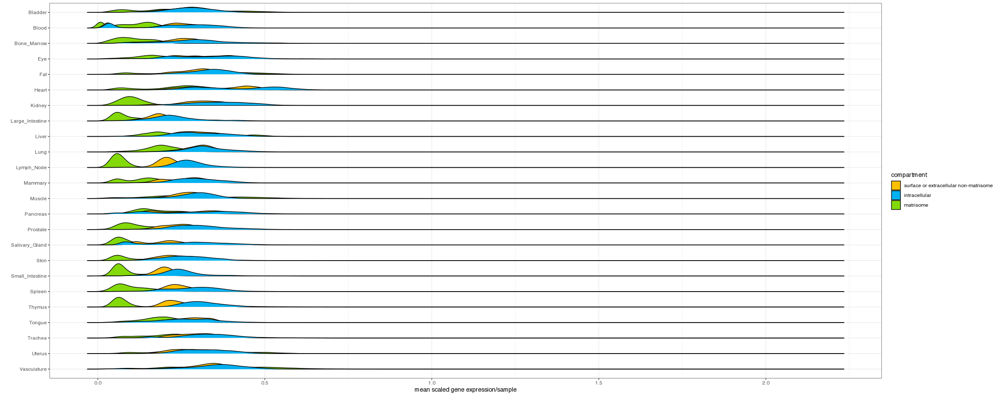
**Figure 1. Gene expression analysis of Tabula Sapiens data.** Mean scaled expression of genes encoding surfaceome or extracellular (yellow), intracellular (blue), and matrisome (green) components across 24 organs from Tabula Sapiens. Plot generated with ggplot2. 

---

### Section 1 - ANALYSES OF MATRICOM PATTERNS
If you are only interested in the final results and data visualization, jump to [Section 2](#section-2---data-visualization).

#### Process open-access datasets with MatriCom  
Using the online [MatriCom](https://matrinet.shinyapps.io/matricom/) interface, import open-access data using *Data Input - Option 2: Select a sample dataset*. Process all 24 Tabula Sapiens (TS) datasets and all 22 datasets from The Human Protein Atlas (THPA) collection for which [Census](https://github.com/sjdlabgroup/Census) annotations are available.

For all datasets, run MatriCom using all default query parameters, as follows:
* Set minimum mean gene expression threshold = `1`
* Set minimum % positive population threshold = `30%`
* Filters: 
  * Maximize model = `TRUE`
  * Use exclusion list = `TRUE`
  * Remove homomeric interactions = `TRUE`
  * Filter by reliability score = `3`
  * Filter by communication type = `Homocellular`, `Heterocellular` 
  * Filter by cellular compartment = `Matrisome`, `Surfacome`, `Extracellular (Non-matrisome)`

For each dataset, export MatriCom output as an XLSX file and save results for TS and THPA data into the folders named [TS-1.30](./TS-1.30/) and [THPA-Census-1.30](./THPA-Census-1.30/), respectively. Name each file for its respective dataset and, finally, rename the following THPA files for consistency with TS nomenclature:

*  `Pbmc.XLSX`  >  `Blood.XLSX`
*  `Adipose_tissue.XLSX`  >  `Fat.XLSX`
*  `Heart_muscle.XLSX`  >  `Heart.XLSX`
*  `Colon.XLSX`  >  `Large intestine.XLSX`
*  `Skeletal_muscle.XLSX`  >  `Muscle.XLSX`
*  `Breast.XLSX`  >  `Mammary.XLSX`

For user convenience, we previously processed all TS and THPA datasets with MatriCom and provide the output files in their respective folders. Note that only the *communication network* sheet of the XLSX file is used in the following analyses. 

#### Identification of MatriCom patterns in open-access data
We first imported processed data from the Tabula Sapiens folder:
```R
tabsap.d <- paste0(work.d, "/TS-1.30")
setwd(tabsap.d)

l <- list.files()
imp <- list()
for(i in l){
  df <- as.data.frame(read_excel(i,sheet="communication network"))
  df$tissue <- gsub(".XLSX","",i)
  imp[[i]] <- df
}
```
Next, we looked for conserved patterns, defined as _GENE1-GENE2_ pairs (or vice versa), that are expressed across multiple organs. Here, we faced the problem of having "reciprocal duplicates" (*i.e.*, inverted pairs, such as _GENE1-GENE2_ and _GENE2-GENE1_) established by different cells across different organs. To avoid it, we treated each tissue/organ as its own simplified network and considered only the identities of the communicating genes without considering which populations establish which pairs. While this does not reflect the biology beneath, it is guaranteed to give consistent analytical results.
```R
d_imp <- bind_rows(imp)
d_imp <- unique(c(d_imp$Gene1,d_imp$Gene2))
ns <- list()
for(i in names(imp)){
  df <- imp[i][[i]]
  df <- df[,c(2,4)]
  n <- simplify(graph_from_data_frame(df,directed = F),remove.loops=F)
  n <- as.matrix(n)
  em <- matrix(0,length(d_imp),length(d_imp))
  rownames(em) <- d_imp
  colnames(em) <- d_imp
  for(w in rownames(n)){
    for(k in colnames(n)){
      if(n[rownames(n)%in%w,colnames(n)%in%k]==0){
        next
      }else{
        em[rownames(em)%in%w,colnames(em)%in%k] <- 1
      }
    }
  }
  ns[[i]] <- em
}
ns <- Reduce('+',ns)
ns <- melt(ns)
ns <- ns[ns$value>0,]
nrow(ns) # 2538 non-directional, simplified pairs
nrow(ns[ns$value>1,]) # 2130 pairs are expressed in more than one tissue
nrow(ns[ns$value>=12,]) # 1200 pairs are expressed in at least 12 (50%) of tissues
ns <- ns[ns$value>=12,]
```

Next, we cross-checked The Human Protein Atlas data for the presence of the same pairs detected in Tabula Sapiens:
```R
census <- paste0(work.d, "/THPA-Census-1.30")
setwd(census)

l <- list.files()
imp <- list()
for(i in l){
  df <- as.data.frame(read_excel(i,sheet="communication network"))
  df$tissue <- gsub(".XLSX","",i)
  imp[[i]] <- df
}
imp <- bind_rows(imp)
df <- imp[,c(2,4)]
ns_tp <- simplify(graph_from_data_frame(df,directed = F),remove.loops=F)
ecount(ns_tp) #374
ns_t <- simplify(graph_from_data_frame(ns[,c(1,2)],directed = F),remove.loops=F)
pats <- ns_t %s% ns_tp
ecount(pats)
```

We then analyzed the matrisome features of common patterns, including matrisome division and category of partners. The matrisome "master list" can be retrieved from The Matrisome Project:
* URL: https://sites.google.com/uic.edu/matrisome/matrisome-annotations/homo-sapiens
* Google sheet: "Download the complete Homo sapiens matrisome list (rev. 2014)"  

Save the spreadsheet  as `Hs_Matrisome_Masterlist_Naba et al_2012.xlsx` and import:
```R
pats <- as.data.frame(as_edgelist(pats))
names(pats) <- c("Gene1","Gene2")

setwd(work.d)
mat <- as.data.frame(read_excel("Hs_Matrisome_Masterlist_Naba et al_2012.xlsx"))
mat <- mat[,c(3,1,2)]
pats <- distinct(merge(pats,mat,by.x="Gene1",by.y="Gene Symbol",all.x=T))
pats <- distinct(merge(pats,mat,by.x="Gene2",by.y="Gene Symbol",all.x=T))
pats[is.na(pats)] <- "Non-matrisome"
pats <- pats[,c(2,1,3:ncol(pats))]
v <- paste0(pats$`Matrisome Division.x`,"_",pats$`Matrisome Division.y`)
v <- as.data.frame(table(v))
v$v[4] <- "Core matrisome_Matrisome-associated"
v$v[7] <- "Core matrisome_Non-matrisome"
v$v[8] <- "Matrisome-associated_Non-matrisome"
v <- aggregate(v$Freq,list(v$v),sum)
v2 <- paste0(pats$`Matrisome Category.x`,"_",pats$`Matrisome Category.y`)
v2 <- as.data.frame(table(v2))
v2$v[10] <- "ECM-affiliated Proteins_ECM Glycoproteins"
v2$v[15] <- "ECM-affiliated Proteins_ECM Regulators"
v2$v[17] <- "Collagens_Non-matrisome"
v2$v[18] <- "ECM Glycoproteins_Non-matrisome"
v2 <- aggregate(v2$Freq,list(v2$v),sum)
```

Finally, we put the patterns back into the data to find out what cells produce them:
```R
setwd(tabsap.d)
ps <- paste0(pats$Gene1,pats$Gene2)
l <- list.files()
imp <- list()
for(i in l){
  df <- as.data.frame(read_excel(i,sheet="communication network"))
  df$tissue <- gsub(".XLSX","",i)
  df$g1g2 <- paste0(df$Gene1,df$Gene2)
  df$g2g1 <- paste0(df$Gene2,df$Gene1)
  k1 <- df[df$g1g2%in%ps,]
  k2 <- df[df$g2g1%in%ps,]
  df <- bind_rows(k1,k2)
  if(nrow(df)<1){
    next
  }else{
    df$g1g2 <- NULL
    df$g2g1 <- NULL
    imp[[i]] <- df
  }
}
tab1 <- bind_rows(imp) #23 tissues (96%) mark positive for at least one pattern in tabula sapiens
setwd(census)
l <- list.files()
imp <- list()
for(i in l){
  df <- as.data.frame(read_excel(i,sheet="communication network"))
  df$tissue <- gsub(".XLSX","",i)
  df$g1g2 <- paste0(df$Gene1,df$Gene2)
  df$g2g1 <- paste0(df$Gene2,df$Gene1)
  k1 <- df[df$g1g2%in%ps,]
  k2 <- df[df$g2g1%in%ps,]
  df <- bind_rows(k1,k2)
  if(nrow(df)<1){
    next
  }else{
    df$g1g2 <- NULL
    df$g2g1 <- NULL
    imp[[i]] <- df
  }
}
tab2 <- bind_rows(imp) #20 tissues (91%) mark positive for at least one pattern in THPA
```
#### Cross-compartment analysis of conserved patterns
We next sought to identify which cell populations contribute to the patterns identified as highly-conserved across tissues/organs. Though we harmonized cell type labels across the two open-access data collections by using Census annotations for THPA data, the granularity of results posed a challenge to high-level summarization. To overcome this, we made use of the _compartment_ annotation used by Tabula Sapiens. 

Tabula Sapiens metadata is available here:
* URL: https://figshare.com/articles/dataset/Tabula_Sapiens_release_1_0/14267219.
* File: `Tabula_Sapiens_metadata.csv`  

The following will retrieve the file automatically: 
```R
setwd(work.d)
www <- "https://figshare.com/ndownloader/files/40066912"
download.file(www, "Tabula_Sapiens_metadata.csv")
```

We assigned all cells in the TS and THPA datasets oto one of five compartments: _immune, endothelial, stromal, epithelial_ or _germ line_. However, because not all annotation matched identically, we resolved mismatches manually and introduced a _stem cell_ compartment label. We also simplified "reciprocal duplicates", such that _GENE1-GENE2_ and _GENE2-GENE1_ pairs were summed and only presented as _GENE1-GENE2_.
```R
meta <- as.data.frame(fread("Tabula_Sapiens_metadata.csv"))
meta <- meta[,c(8,11)]
meta$cell_ontology_class <- gsub(" ",".",meta$cell_ontology_class)
pl1 <- tab1
pl1$Population1 <- tolower(pl1$Population1)
pl1$Population2 <- tolower(pl1$Population2)
cr <- unique(meta$cell_ontology_class)
c1 <- unique(c(pl1$Population1,pl1$Population2))
c1.1 <- intersect(c1,cr)
length(c1.1)/length(c1) #80% of the annotations match
c1.2 <- setdiff(c1,cr)
anns <- list()
for(i in c1.2){
  z <- meta[grepl(i,meta$cell_ontology_class,ignore.case = T),]
  if(nrow(z)<1){
    df <- data.frame(cellid=i,
                     cell_ontology_class="not.available",
                     compartment="not.available")
  }else{
    z$cellid <- i
    z <- z[,c(3,1,2)]
    df <- z
  }
  anns[[i]] <- df
}
anns <- bind_rows(anns)
anns <- distinct(anns)
anns1 <- anns[anns$compartment!="not.available",] #anns1 features stem cells that could be of many tyes, so we add a new category here
anns1[3:10,c(2,3)] <- "stem cell"
anns2 <- anns[anns$compartment=="not.available",] #"immune"      "endothelial" "stromal"     "epithelial"  "germ line"
anns2[1:2,c(2,3)] <- "epithelial"
anns2[3:6,c(2,3)] <- "immune"
anns2[8,c(2,3)] <- "immune"
anns2[9:10,c(2,3)] <- "epithelial"
anns2[11:18,c(2,3)] <- "immune"
anns2[19:21,c(2,3)] <- "epithelial"
anns2[22:26,c(2,3)] <- "immune"
anns3 <- meta[meta$cell_ontology_class%in%c1.1,]
anns <- bind_rows(anns1,anns2,anns3)
anns <- anns[,c(1,3)]
m <- meta[meta$cell_ontology_class%in%c1.1,]
names(m) <- names(anns)
anns <- bind_rows(m,anns)
anns <- distinct(anns)
sv.anns <- anns
m1 <- anns[match(pl1$Population1,anns$cellid),]
m2 <- anns[match(pl1$Population2,anns$cellid),]
m <- data.frame(from=m1$compartment,to=m2$compartment)
m <- as.data.frame(table(m$from,m$to))
m <- m[m$Freq>0,]
names(m)[3] <- "weight"
g <- graph_from_edgelist(as.matrix(m[,c(1,2)]),directed = F)
E(g)$weight <- m$weight
g <- simplify(g,edge.attr.comb=list(weight="sum"),remove.loops=F)
m <- as.data.frame(as_edgelist(g))
m$Freq <- E(g)$weight
set.seed(1234)
combs <- expand.grid(m$V1,m$V2)
combs <- paste0(combs$Var1,"_",combs$Var2)
combs <- unique(combs)
cols <- rand_color(length(combs))
names(cols) <- combs
m$col <- paste0(m$V1,"_",m$V2)
z <- cols[match(m$col,names(cols))]
m$col <- z
counts1 <- m

pl2 <- tab2
pl2$Population1 <- tolower(pl2$Population1)
pl2$Population2 <- tolower(pl2$Population2)
cr <- unique(meta$cell_ontology_class)
c1 <- unique(c(pl2$Population1,pl2$Population2))
c1.1 <- intersect(c1,cr)
length(c1.1)/length(c1) #93% of the annotations match
c1.2 <- setdiff(c1,cr)
anns <- list()
for(i in c1.2){
  z <- meta[grepl(i,meta$cell_ontology_class,ignore.case = T),]
  if(nrow(z)<1){
    df <- data.frame(cellid=i,
                     cell_ontology_class="not.available",
                     compartment="not.available")
  }else{
    z$cellid <- i
    z <- z[,c(3,1,2)]
    df <- z
  }
  anns[[i]] <- df
}
anns <- bind_rows(anns)
anns <- distinct(anns)
anns1 <- anns[anns$compartment!="not.available",]
anns2 <- anns[anns$compartment=="not.available",]
anns2[1:2,c(2,3)] <- "immune"
anns3 <- meta[meta$cell_ontology_class%in%c1.1,]
anns <- bind_rows(anns1,anns2,anns3)
anns <- anns[,c(1,3)]
m <- meta[meta$cell_ontology_class%in%c1.1,]
names(m) <- names(anns)
anns <- bind_rows(m,anns)
anns <- distinct(anns)
m1 <- anns[match(pl2$Population1,anns$cellid),]
m2 <- anns[match(pl2$Population2,anns$cellid),]
m <- data.frame(from=m1$compartment,to=m2$compartment)
m <- as.data.frame(table(m$from,m$to))
m <- m[m$Freq>0,]
names(m)[3] <- "weight"
g <- graph_from_edgelist(as.matrix(m[,c(1,2)]),directed = F)
E(g)$weight <- m$weight
g <- simplify(g,edge.attr.comb=list(weight="sum"),remove.loops=F)
m <- as.data.frame(as_edgelist(g))
m$Freq <- E(g)$weight
m$col <- paste0(m$V1,"_",m$V2)
z <- cols[match(m$col,names(cols))]
m$col <- z
counts2 <- m

# examples of pleiotropy and specialization
# COL6A1/CD44
s1 <- tab1[tab1$Gene1%in%"COL6A1" & tab1$Gene2%in%"CD44",]
s1 <- merge(s1,sv.anns,by.x="Population1",by.y="cellid",all.x=T)
s1 <- merge(s1,sv.anns,by.x="Population2",by.y="cellid",all.x=T)
s1[is.na(s1)] <- "not.available"
z <- simplify(graph_from_data_frame(s1[,c(18,19)],directed = F),remove.loops = F)
m1 <- as.data.frame(as.matrix(as_adj(z)))
# TIMP2/MMP14
s1 <- tab1[tab1$Gene1%in%"TIMP2" & tab1$Gene2%in%"MMP14",]
s1 <- merge(s1,sv.anns,by.x="Population1",by.y="cellid",all.x=T)
s1 <- merge(s1,sv.anns,by.x="Population2",by.y="cellid",all.x=T)
s1[is.na(s1)] <- "not.available"
z <- simplify(graph_from_data_frame(s1[,c(18,19)],directed = F),remove.loops = F)
m2 <- as.data.frame(as.matrix(as_adj(z)))
# CD44/HYAL2
s1 <- tab1[tab1$Gene1%in%"CD44" & tab1$Gene2%in%"HYAL2",]
s1 <- merge(s1,sv.anns,by.x="Population1",by.y="cellid",all.x=T)
s1 <- merge(s1,sv.anns,by.x="Population2",by.y="cellid",all.x=T)
s1[is.na(s1)] <- "not.available"
z <- simplify(graph_from_data_frame(s1[,c(18,19)],directed = F),remove.loops = F)
m3 <- as.data.frame(as.matrix(as_adj(z)))
# SELP/COL18A1
s1 <- tab1[tab1$Gene1%in%"SELP" & tab1$Gene2%in%"COL18A1",]
s1 <- merge(s1,sv.anns,by.x="Population1",by.y="cellid",all.x=T)
s1 <- merge(s1,sv.anns,by.x="Population2",by.y="cellid",all.x=T)
s1[is.na(s1)] <- "not.available"
z <- simplify(graph_from_data_frame(s1[,c(18,19)],directed = F),remove.loops = F)
m4 <- as.data.frame(as.matrix(as_adj(z)))
```

#### Analysis of conserved pattern-associated transcription factors
The complete TF2DNA database can be retrieved from here:
* URL: https://www.fiserlab.org/tf2dna_db/downloads.html
* File: `TF target files [1.9G]`    

Once downloaded and unzipped, only the `/pscan_files/Homo-sapiens_theoretical_TF2DNA` folder is needed.
The following will retrieve the folder automatically: 
```R
setwd(work.d)
www <- "http://fiserlab.org/pscan_files.tar.gz"
download.file(www, "pscan_files.tar.gz", method = "wget")
untar("pscan_files.tar.gz", files="pscan_files/Homo-sapiens_theoretical_TF2DNA")
pscan <- paste0(work.d, "/pscan_files/Homo-sapiens_theoretical_TF2DNA")
```

To identify TFs that potentially regulate conserved patterns, we identified sets of common TFs found to target communicating partners:
```R
setwd(pscan)

l <- list.files()
lst <- list()
for(i in l){
  z <- as.data.frame(fread(i))
  z <- z[,c(1,2)]
  lst[[i]] <- z
}
lst <- bind_rows(lst)

setwd(work.d)

p <- pats
lst2 <- list()
for(i in 1:nrow(p)){
  z <- p[i,]
  a <- lst[lst$target_name%in%z$Gene1,]
  if(nrow(a)<1){
    a <- "none"
  }
  b <- lst[lst$target_name%in%z$Gene2,]
  if(nrow(b)<1){
    b <- "none"
  } 
  a <- unique(a$tf_name)
  b <- unique(b$tf_name)
  lst2[[i]] <- data.frame(pattern=paste0(z$Gene1,"_",z$Gene2),
                          common_TFs=intersect(a,b))
}
```

We further checked for common TFs of conserved patterns. The annotated TF-target table cen be retrieved from TTRUST:
* URL: http://tf.liclab.net/TFTG/ 
* File: `Curate.txt`

Note that the upstream link is seemingly unavailable at the moment, so we provide it as a zipped file [here](./Curate.txt).

```R
unzip("Curate.txt.zip")

lst2 <- bind_rows(lst2) #all pairs found common TFs (length(unique(lst2$pattern)))
cur <- as.data.frame(fread("Curate.txt"))
lst3 <- list()
for(i in 1:nrow(p)){
  z <- p[i,]
  a <- cur[grepl(z$Gene1,cur$gene,ignore.case = T),1]
  if(length(a)<1){
    a <- "none"
  }
  b <- cur[grepl(z$Gene2,cur$gene,ignore.case = T),1]
  if(length(b)<1){
    b <- "none"
  } 
  a <- unique(a)
  b <- unique(b)
  lst3[[i]] <- data.frame(pattern=paste0(z$Gene1,"_",z$Gene2),
                          common_TFs=intersect(a,b))
}
lst3 <- bind_rows(lst3) #all pairs found common TFs (length(unique(lst3$pattern)))
fin <- list()
for(i in unique(lst2$pattern)){
  a <- lst2[lst2$pattern%in%i,2]
  b <- lst3[lst3$pattern%in%i,2]
  int <- intersect(a,b)
  if(length(int)<1){
    int <- "none"
  }
  fin[[i]] <- data.frame(pattern=i,
                         final.common.TFs=int)
}
fin <- bind_rows(fin) #all pairs found common matching TFs (length(unique(fin$pattern)))
```

To annotate TF families, we used data from [Lambert et al., Cell 2018](https://www.cell.com/cell/fulltext/S0092-8674(18)30106-5). 

The supplementary table of human TF annotations can be retrieved from here:
* URL: https://www.cell.com/cell/fulltext/S0092-8674(18)30106-5#supplementaryMaterial
* File: "Spreadsheet (5.81 MB) Document S1. Tables S1–S4"

Save the file as `mmc2.xlsx`. Note that only _Table S1_ is used for annotation. 

```R
fams <- read_xlsx("mmc2.xlsx",sheet="Table S1. Related to Figure 1B")
fams <- as.data.frame(fams[-1,c(2,3)])
names(fams) <- c("gene","family")

fin <- distinct(merge(fin,fams,by.x="final.common.TFs",by.y="gene",all.x=T)) #only one pattern with no common TF is here
fin <- fin[fin$final.common.TFs!="none",]
names(fin)[3] <- "TF family"
```

Export the data into a RDS file for easier plotting in the following section (as well as for data sharing):
```R
matricom_patterns <- list(
    nondirectional.patterns=pats,
    patterns.tabsap=tab1,
    patterns.thpa=tab2,
    compartment.com.tabsap=counts1,
    compartment.com.thpa=counts2,
    matrisome.divisions=v,
    matrisome.categories=v2,
    examples=list(COL6A1.CD44=m1,
                  TIMP2.MMP14=m2,
                  CD44.HYAL2=m3,
                  SELP.COL18A1=m4
                  ),
    tfs=fin
)

saveRDS(matricom_patterns, "matricom_patterns.RDS")
```

---

### Section 2 - DATA VISUALIZATION
Load the `matrisome_patterns.RDS` files generated in Section 1 or, if you jumped directly to this section, load the file we provide [here](./matricom_patterns.RDS).

```R
# Your own, generated from the previous step
matricom_patterns <- readRDS("matricom_patterns.RDS")

# The one from us
matricom_patterns <- readRDS("matricom_patterns/matricom_patterns.RDS")
```

#### Plot of the network
```R
fin.net <- matricom_patterns$nondirectional.patterns
mt <- matricom_patterns$nondirectional.patterns
mt1 <- mt[,c(1,3)]
mt2 <- mt[,c(2,5)]
names(mt1) <- c("gene","div")
names(mt2) <- c("gene","div")
mt <- distinct(bind_rows(mt1,mt2))
table(mt$div)
n <- graph_from_data_frame(fin.net[,c(1,2)],directed = F)
v <- names(V(n))
mt <- mt[match(v,mt$gene),]
cols <- ifelse(mt$div%in%"Non-matrisome","#EBEBEB",
               ifelse(mt$div%in%"Core matrisome","#002060","#db3e18"))

# See figure 2.
plot(n,
     layout=layout_with_kk, 
     vertex.label="",
     vertex.size=igraph::degree(n),
     vertex.color=cols)
```

#### Plot of the matrisome categories
```R
m <- matricom_patterns$matrisome.categories
m$V1 <- gsub("_.*","",m$Group.1)
m$V2 <- gsub(".*_","",m$Group.1)
m <- m[,c(3,4,2)]
m$x <- round((m$x/sum(m$x))*100,2)
m <- acast(m,V1~V2,value.var="x")
m[is.na(m)] <- 0
m <- rescale(m,to=c(0,1))
m <- m[c(1,6,7,3,2,4,5),c(1,3,2,4,6,5)]

# See figure 2.
corrplot(m, method="color")
```

|Network|Categories|
|---|---|
|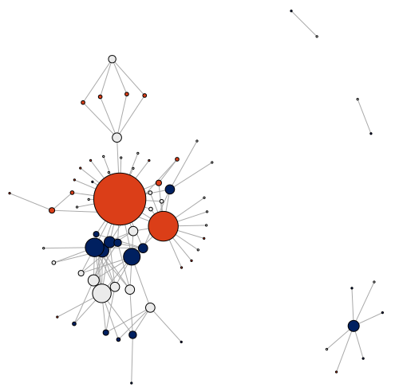 |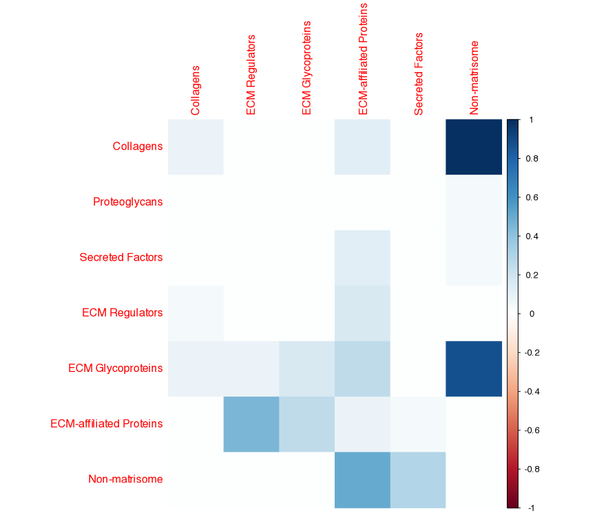|  

*Figure 2. Network and Categories.*

#### Plot of compartment interactions
```R
m1 <- matricom_patterns$compartment.com.tabsap
m1 <- unique(c(m1$V1,m1$V2))
set.seed(1234)
col <- rand_color(7)
col[1] <- "#EE2F24FF"
col[2] <- "navy"
col[3] <- "pink"
col[4] <- "#47D111FF"
col[5] <- "grey"
col[6] <- "purple"
col[7] <- "orange"
chordDiagram(matricom_patterns$compartment.com.tabsap,grid.col = col,col = matricom_patterns$compartment.com.tabsap$col)
col <- col[c(2,4,7)]
chordDiagram(matricom_patterns$compartment.com.thpa,grid.col = col,col = matricom_patterns$compartment.com.thpa$col)
```
|Tabula Sapiens|The Human Protein Atlas|
|---|---|
|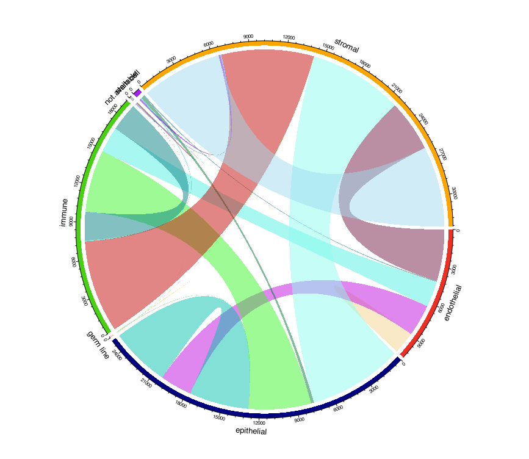 |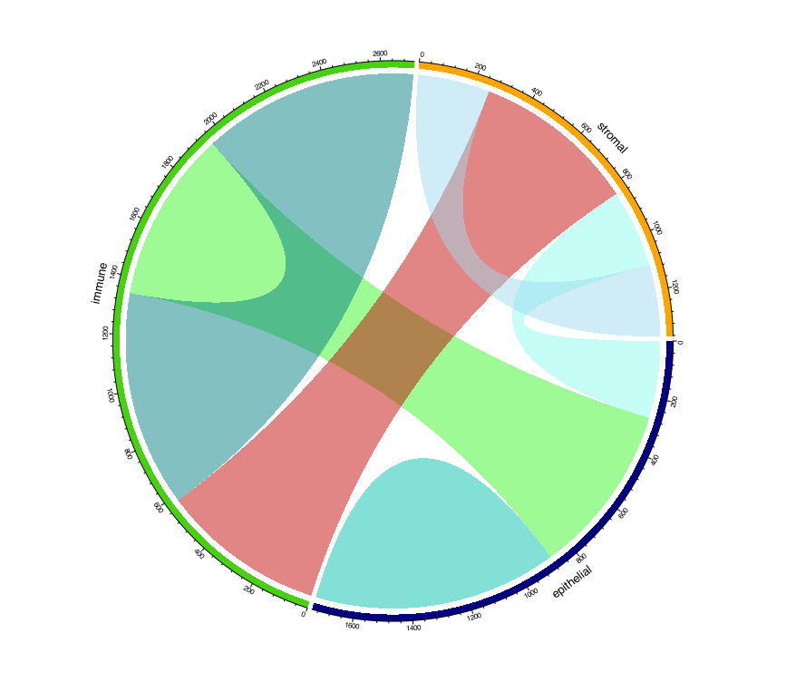|  

*Figure 3. Compartment interactions.*

#### Plot of tissue/organ correlation by patterns
```R
p <- matricom_patterns$nondirectional.patterns
m <- matricom_patterns$patterns.tabsap
a1 <- m[,c(1,ncol(m))]
a2 <- m[,c(5,ncol(m))]
names(a2) <- names(a1)
tot <- distinct(bind_rows(a1,a2))
tot <- as.data.frame(table(tot$tissue))
mat <- matrix(0,length(unique(m$tissue)),nrow(p))
rownames(mat) <- unique(m$tissue)
colnames(mat) <- paste0(p$Gene1,"_",p$Gene2)
for(i in 1:nrow(p)){
  z <- p[i,]
  k <- m[m$Gene1%in%p[i,1] & m$Gene2%in%p[i,2],]
  k2 <- m[m$Gene1%in%p[i,2] & m$Gene2%in%p[i,1],]
  k <- bind_rows(k,k2)
  k <- na.omit(k)
  a1 <- k[,c(1,ncol(k))]
  a2 <- k[,c(5,ncol(k))]
  names(a2) <- names(a1)
  k <- distinct(bind_rows(a1,a2))
  k <- as.data.frame(table(k$tissue))
  k <- merge(k,tot,by="Var1",all.y=T)
  k[is.na(k)] <- 0
  k$perc <- (k$Freq.x/k$Freq.y)*100
  mat[rownames(mat)%in%k$Var1,i] <- k$perc
}

# See Figure 4
pheatmap(cor(mat),cellwidth=4,cellheight=4,fontsize=4)
mat2 <- t(mat)
ph <- pheatmap(cor(mat))
ph <- ph$tree_row$labels[ph$tree_row$order]
mat2 <- mat2[match(ph,rownames(mat2)),]
pheatmap(mat2,cellwidth=4,cellheight=4,fontsize=4,cluster_rows = F, cluster_cols = F, rocket(10))
```

|mat|ph|mat2|
|---|---|---|
|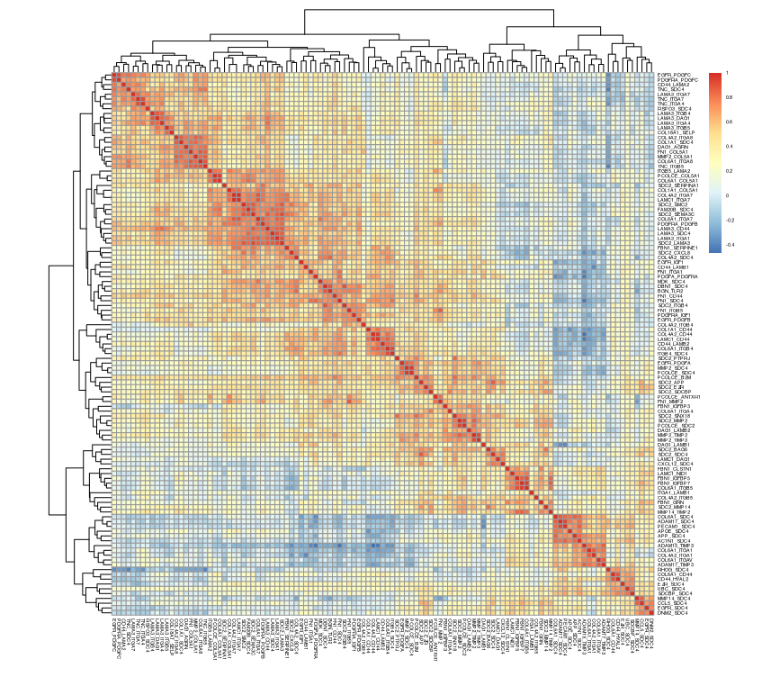||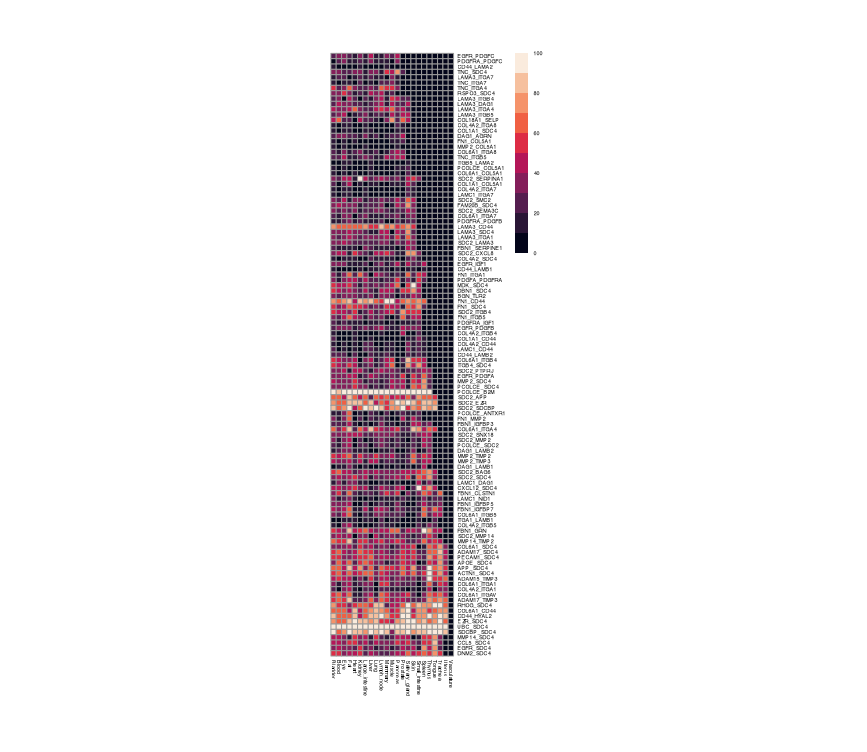|

*Figure 4. Heatmaps.*

Plots of pleiotropy and specialization:
```R
m <- matricom_patterns$examples$COL6A1.CD44
m <- m[!(rownames(m)%in%"not.available"),!(colnames(m)%in%"not.available")]
rownames(m) <- factor(rownames(m),levels = c("epithelial","endothelial","stromal","immune","stem cell"))
colnames(m) <- factor(colnames(m),levels = c("epithelial","endothelial","stromal","immune","stem cell"))
pheatmap(m,cluster_rows = F,cluster_cols = F,color=c("white","#FE6053"))

m <- matricom_patterns$examples$CD44.HYAL2
m <- m[!(rownames(m)%in%"not.available"),!(colnames(m)%in%"not.available")]
rownames(m) <- factor(rownames(m),levels = c("epithelial","endothelial","stromal","immune","stem cell"))
colnames(m) <- factor(colnames(m),levels = c("epithelial","endothelial","stromal","immune","stem cell"))
pheatmap(m,cluster_rows = F,cluster_cols = F,color=c("white","#FE6053"))

m <- matricom_patterns$examples$SELP.COL18A1
m <- m[!(rownames(m)%in%"not.available"),!(colnames(m)%in%"not.available")]
rownames(m) <- factor(rownames(m),levels = c("epithelial","endothelial","stromal","immune","stem cell"))
colnames(m) <- factor(colnames(m),levels = c("epithelial","endothelial","stromal","immune","stem cell"))
pheatmap(m,cluster_rows = F,cluster_cols = F,color=c("white","#FE6053"))
```

|_COL6A1-CD44_|_CD44-HYAL2_|_SELP-COL18A1_|
|---|---|---|
|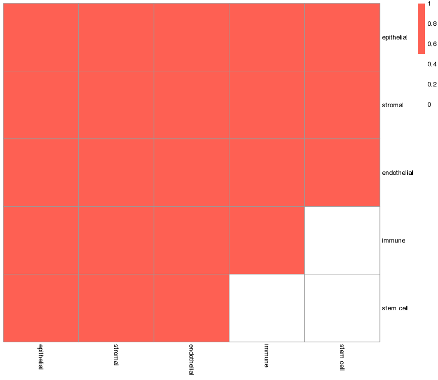|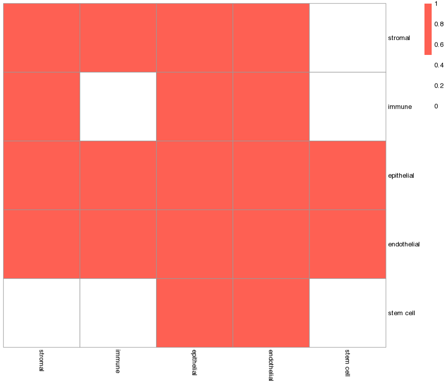|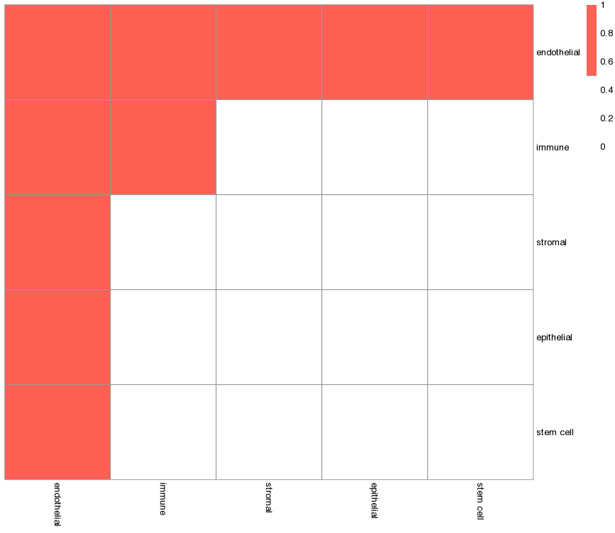|

*Figure 5. Pleiotropy and specialization*

#### Plots of TFs and TF families
```R
fin <- matricom_patterns$tfs
fin.tab <- as.data.frame(table(fin$final.common.TFs))
fin.tab <- fin.tab[order(-fin.tab$Freq),]
fin.tab$Var1 <- factor(fin.tab$Var1,levels=as.character(fin.tab$Var1))
ggplot(fin.tab,aes(Var1,Freq)) +
  geom_bar(stat="identity",fill="navyblue") +
  theme_bw() + xlab("") + ylab("number of regulated pairs") +
  theme(legend.position = "none",
        axis.text.x = element_text(angle = 90, vjust = 0.5, hjust=1))

mt <- list()
for(i in unique(fin$pattern)){
  z <- fin[fin$pattern%in%i,]
  df <- data.frame(t(rep(1,nrow(z))))
  names(df) <- z$final.common.TFs
  mt[[i]] <- df
}
mt <- bind_rows(mt)
mt[is.na(mt)] <- 0
pheatmap(cor(mt))

gf <- as.data.frame(table(fin$`TF family`))
gf <- gf[order(-gf$Freq),]
gf$Var1 <- factor(gf$Var1,levels=rev(as.character(gf$Var1)))
ggplot(gf,aes(Var1,Freq)) +
  geom_bar(stat="identity",fill="darkred") +
  theme_bw() + xlab("") + ylab("number of TFs in the family") +
  theme(legend.position = "none",
        axis.text.x = element_text(angle = 90, vjust = 0.5, hjust=1)) +
  coord_flip()

gostres <- gost(query = fin$final.common.TFs, 
                organism = "hsapiens",
                evcodes = T)
gostplot(gostres)

res <- gostres$result
res <- res[res$source%in%c("GO:MF","GO:BP","HPA","KEGG","REAC","WP"),]
enlist <- list()
for(i in unique(res$term_name)){
  z <- res[res$term_name==i,]
  if(nrow(z)<2){
    l <- unlist(strsplit(z$intersection,split=","))
    df <- data.frame(t(rep(1,z$intersection_size)))
    names(df) <- l
    enlist[[i]] <- df 
  }else{
    l <- lapply(z$intersection,function(x){
      strsplit(x,split=",")
    })
    l <- unique(unlist(l))
    df <- data.frame(t(rep(1,length(l))))
    names(df) <- l
    enlist[[i]] <- df 
  }
}
enlist <- bind_rows(enlist)
rownames(enlist) <- unique(res$term_name)
enlist <- cor(enlist)
enlist[is.na(enlist)] <- 0
pheatmap(enlist,fontsize = 5,color=colorRampPalette(c("white", "red"))(50))
```

|fin.tab|gf|hmmt|
|---|---|---|
|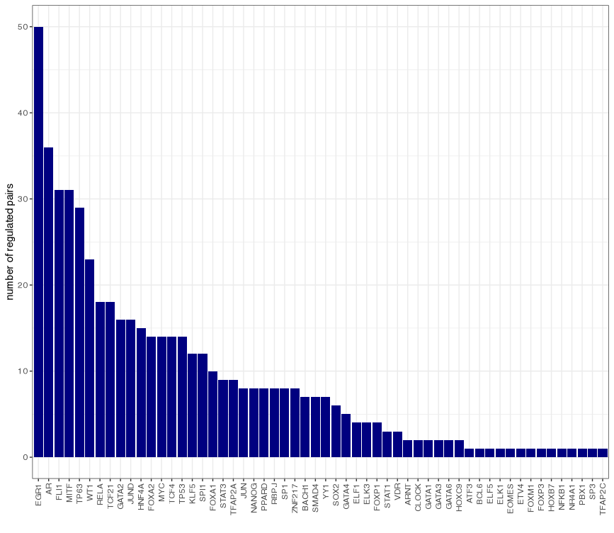|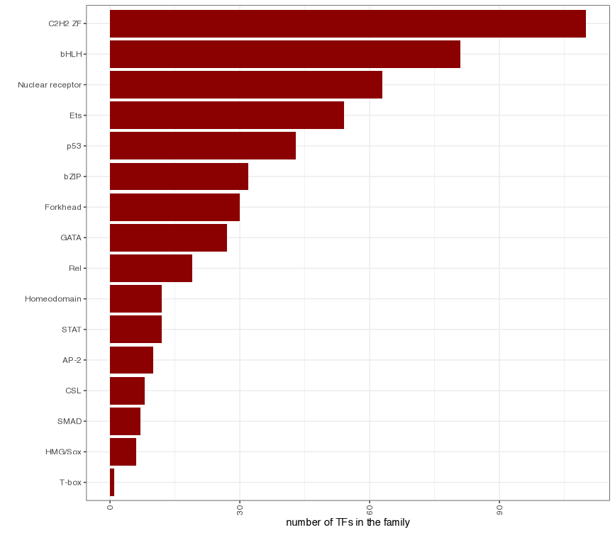|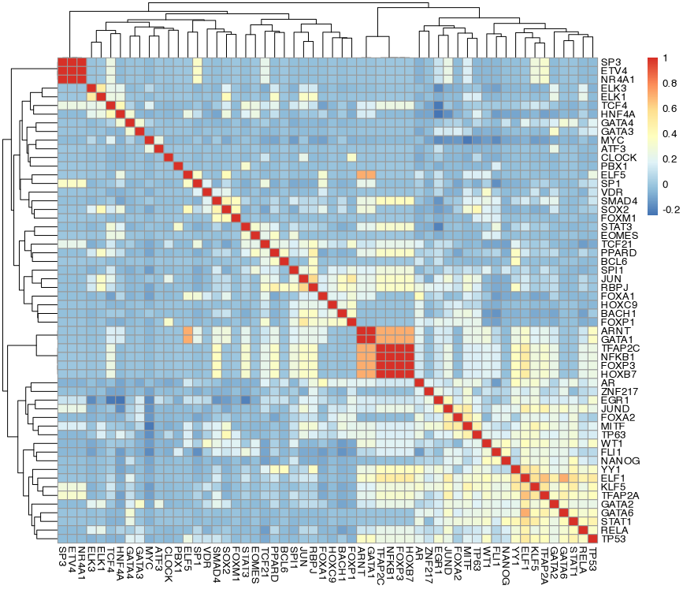|

|gostres|enlist|
|---|---|
|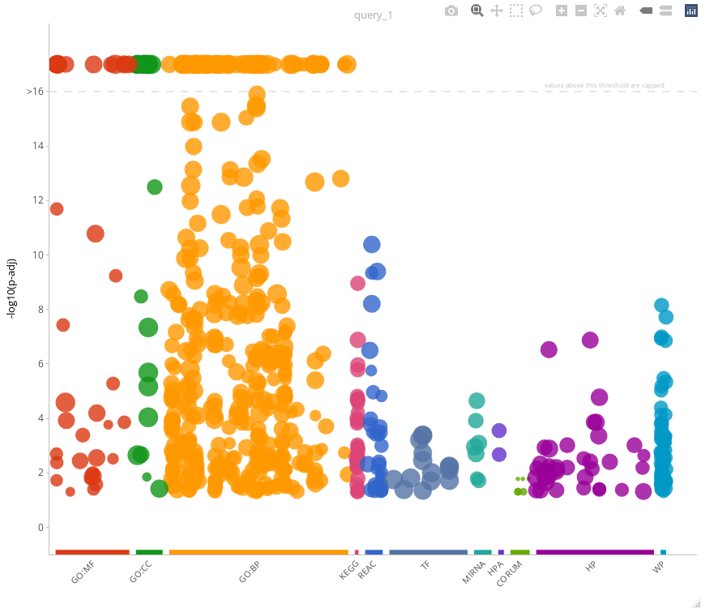|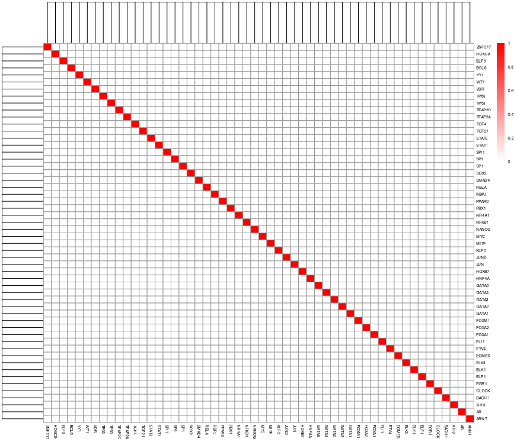|

*Figure 6. TFs and TF families*
