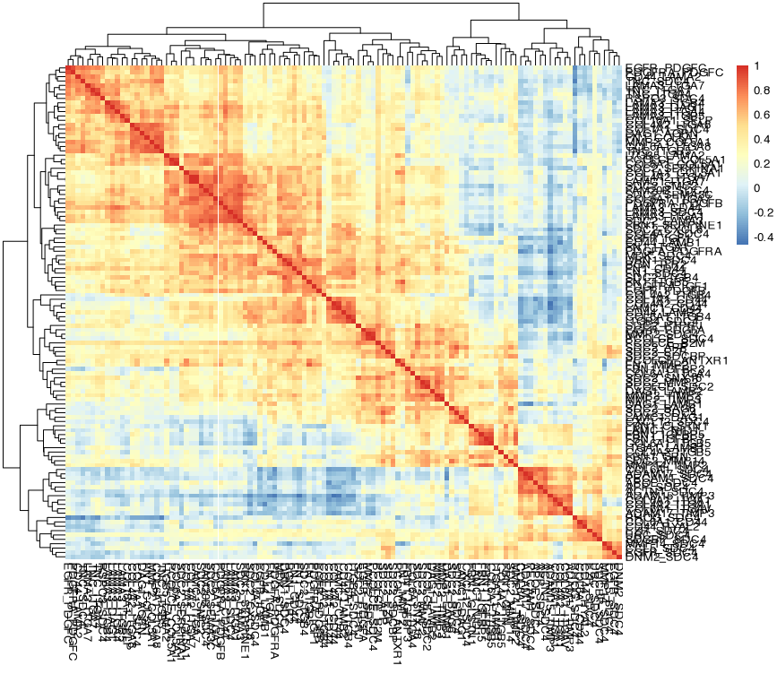

## Matricom Patterns in open access (OA) data
All steps discussed below are included in a **single script**, called [patterns_matricom.R](patterns_matricom.R).

The workflow is divided into three sections.  
* [Section 0: Comparative data analysis](#section-0-comparative-data-analysis). Comparative expression between matrisome and non-matrisome genes from Tabula Sapiens data.  
* [Section 1: Data analyses](#section-1-data-analysis). Process the open access data from Tabula Sapiens and The Human Protein Atlas by MatriCom, then look for "patterns" pairs (gene1-gene2 or vice versa) that are expressed across multiple organs.  
* [Section 2: Plotting](#section-2-plotting): Visualize various aspects of the results, such as network, interactions between compartments, tissue/organ patterns correlation and more.  

### Libraries needed
```R
library(dplyr)
library(data.table)
library(Seurat)
library(EnsDb.Hsapiens.v79)
library(readxl)
library(igraph)
library(Matrix)
library(reshape2)
library(ggplot2)
library(ggsci)
library(ggridges)
library(corrplot)
library(pheatmap)
library(scales)
library(uwot)
library(circlize)
library(viridis)
library(gprofiler2)
```

### Set up
Work dir, for example the current folder, but set up to your liking. All subsequent subfolders will be created here.
```R
work.d <- setwd(".")
```
Downloads time out. Some downloads are quite large, so setting specifying a longer timeout may be needed. This will increase it to 30 min:
```R
options(timeout=1800)
```

### SECTION 0: COMPARATIVE DATA ANALYSIS
**Matrisome gene expression in Tabula Sapiens - how do matrisome counts compare
to non-matrisome ones?** 

Data is from https://cellxgene.cziscience.com/datasets
* Filters > Publication > The Tabula Sapiens Consortium et al. (2022) Science

In our scheme, we download the data for all cells in RDS format. This will do it
**automatically** (file size is 10.4 GiB, therefore the timeout option from above may be useful):
```R
www <- "https://datasets.cellxgene.cziscience.com/981bcf57-30cb-4a85-b905-e04373432fef.rds"
download.file(www, "all_cells.rds")
tabsap <- readRDS("all_cells.rds")
```

This file from the MatriCom app, contains cell compartment information for genes and should be loaded as follows :
```R
cc <- readRDS("CCgenes2.RDS")
```
Note that we will need to operate conversions from EnsemblId to gene symbol
for the count tables. Also, we won't provide these data publicly as they are
just an analysis of open access (OA) data, so plots will follow results in
this section.
```R
cc$label <- ifelse(cc$label%in%"cell membrane","intracellular",
                   ifelse(cc$label %in% c("extracellular","surfaceome"),"surface or extracellular non-matrisome","matrisome"))
g <- ensembldb::select(EnsDb.Hsapiens.v79, keys= rownames(tabsap@assays$RNA@data), keytype = "GENEID", columns = c("SYMBOL","GENEID"))
gs <- g[duplicated(g$SYMBOL),] #the vast majority is SNORS, but we will keep eveything
gs$SYMBOL <- paste0(gs$SYMBOL,"_",c(1:nrow(gs)))
gs <- bind_rows(g[!duplicated(g$SYMBOL),],gs)
gs <- gs[match(rownames(tabsap@assays$RNA@data),gs$GENEID),]
gs <- na.omit(gs)
gs <- gs[gs$SYMBOL%in%cc$gene,]
m <- tabsap@assays$RNA@data[rownames(tabsap@assays$RNA@data)%in%gs$GENEID,]
l <- list()
for(i in unique(cc$label)){
  g <- gs$GENEID[gs$SYMBOL%in%cc[cc$label%in%i,1]] 
  k <- colMeans(m[rownames(m)%in%g,])
  l[[i]] <- data.frame(v=unlist(k),compartment=i)
}
l <- bind_rows(l)
l$organ <- tabsap@meta.data$tissue_in_publication
lv <- unique(tabsap@meta.data$tissue_in_publication)[order(unique(tabsap@meta.data$tissue_in_publication))]
l$organ <- factor(l$organ,levels = rev(lv))
l$compartment <- factor(l$compartment,levels=c("matrisome","surface or extracellular non-matrisome","intracellular"))

# See Figure 1 for output preview
ggplot(l,aes(v,organ,fill=compartment)) + 
  geom_density_ridges(scale = 0.9) +
  # scale_fill_frontiers() +
  scale_fill_manual(breaks=unique(l$compartment),
                    values=c("#FFC000","#00B0F0","#83D90A")) +
  theme_bw() + xlab("mean scaled gene expression/sample") + ylab("")

obj <- l %>% group_by(organ) %>% do(model = aov(v~compartment, data = .))
lapply(obj$model, summary)
```

**Figure 1. Comparative data analysis.** Preview of ggplot's output.

### SECTION 1: DATA ANALYSIS
If you are only interested in the final results and plotting, skip to [Section 2](#section-2-plotting).

Get [MatriCom](https://matrinet.shinyapps.io/matricom/) data (open access).
Use "Option 2: Select a sample dataset". From 
the Tabula Sapiens (TS) collection, process all 24 tissue datasets. From the
Human Protein Atlas (THPA) collection, process the 22 tissue datasets that can
be reannotated with Census. 

Use default MatriCom settings for both:
* Set minimum mean gene expression threshold = 1
* Set minimum % positive population threshold = 30%
* Filters: 
  * Maximize model 
  * Use exclusion list
  * Remove homomeric interactions
* Filter by reliability score: 3
* Filter by communication type: 
  * Homocellular
  * Heterovellular
* Filter by cellular compartment:
  * Matrisome
  * Surfaceome
  * Extracellular (Non-matrisome)

Save results in `XLSX` format, naming the files after the respective dataset, in
folders named [TS-1.30](./TS-1.30/) and [THPA-Census-1.30](./THPA-Census-1.30/),
respectively for TS and THPA.
In addition, for THPA results, rename the following, to be consistent with TS:

*  Pbmc.XLSX -> Blood.XLSX
*  Adipose_tissue.XLSX -> Fat.XLSX
*  Heart_muscle.XLSX -> Heart.XLSX
*  Colon.XLSX -> Large intestine.XLSX
*  Skeletal_muscle.XLSX -> Muscle.XLSX
*  Breast.XLSX -> Mammary.XLSX

For users' convenience, these have been downloaded by us and are available in their
respective folders. The sheet that will be processed is called "communication
network".

Process Tabula Sapiens data from its folder
```R
tabsap.d <- paste0(work.d, "/TS-1.30")
setwd(tabsap.d)

l <- list.files()
imp <- list()
for(i in l){
  df <- as.data.frame(read_excel(i,sheet="communication network"))
  df$tissue <- gsub(".XLSX","",i)
  imp[[i]] <- df
}
```

We will look for "patterns" as gene1-gene2 (or vice versa) pairs that are
expressed across multiple organs. Here, we face the possible problem of having
"logical duplicates" (inverted pairs, such as A-B and B-A) across different
cells in different organs. To avoid it, we decide to turn each tissue/organ
into its own simplified network, not considering what cells participate to
what pairs and eventual directionalities. While this could be "brutal" to the
biology beneath, it is guaranteed to give consistent analytical results.
```R
d_imp <- bind_rows(imp)
d_imp <- unique(c(d_imp$Gene1,d_imp$Gene2))
ns <- list()
for(i in names(imp)){
  df <- imp[i][[i]]
  df <- df[,c(2,4)]
  n <- simplify(graph_from_data_frame(df,directed = F),remove.loops=F)
  n <- as.matrix(n)
  em <- matrix(0,length(d_imp),length(d_imp))
  rownames(em) <- d_imp
  colnames(em) <- d_imp
  for(w in rownames(n)){
    for(k in colnames(n)){
      if(n[rownames(n)%in%w,colnames(n)%in%k]==0){
        next
      }else{
        em[rownames(em)%in%w,colnames(em)%in%k] <- 1
      }
    }
  }
  ns[[i]] <- em
}
ns <- Reduce('+',ns)
ns <- melt(ns)
ns <- ns[ns$value>0,]
nrow(ns) # 2538 non-directional, simplified pairs
nrow(ns[ns$value>1,]) # 2130 pairs are expressed in more than one tissue
nrow(ns[ns$value>=12,]) # 1200 pairs are expressed in at least 12 (50%) of tissues
ns <- ns[ns$value>=12,]
```

Finally, we will cross-check into The Human Protein Atlas collections for the presence of these
same pairs.
```R
census <- paste0(work.d, "/THPA-Census-1.30")
setwd(census)

l <- list.files()
imp <- list()
for(i in l){
  df <- as.data.frame(read_excel(i,sheet="communication network"))
  df$tissue <- gsub(".XLSX","",i)
  imp[[i]] <- df
}
imp <- bind_rows(imp)
df <- imp[,c(2,4)]
ns_tp <- simplify(graph_from_data_frame(df,directed = F),remove.loops=F)
ecount(ns_tp) #374
ns_t <- simplify(graph_from_data_frame(ns[,c(1,2)],directed = F),remove.loops=F)
pats <- ns_t %s% ns_tp
ecount(pats)
```

Here, we will analyze the matrisome features of the common patterns. The
Matrisome "masterlist" should be downloaded from:
* url: https://sites.google.com/uic.edu/matrisome/matrisome-annotations/homo-sapiens
* file: Hs_Matrisome_Masterlist_Naba et al_2012.xlsx
```R
pats <- as.data.frame(as_edgelist(pats))
names(pats) <- c("Gene1","Gene2")

setwd(work.d)
mat <- as.data.frame(read_excel("Hs_Matrisome_Masterlist_Naba et al_2012.xlsx"))
mat <- mat[,c(3,1,2)]
pats <- distinct(merge(pats,mat,by.x="Gene1",by.y="Gene Symbol",all.x=T))
pats <- distinct(merge(pats,mat,by.x="Gene2",by.y="Gene Symbol",all.x=T))
pats[is.na(pats)] <- "Non-matrisome"
pats <- pats[,c(2,1,3:ncol(pats))]
v <- paste0(pats$`Matrisome Division.x`,"_",pats$`Matrisome Division.y`)
v <- as.data.frame(table(v))
v$v[4] <- "Core matrisome_Matrisome-associated"
v$v[7] <- "Core matrisome_Non-matrisome"
v$v[8] <- "Matrisome-associated_Non-matrisome"
v <- aggregate(v$Freq,list(v$v),sum)
v2 <- paste0(pats$`Matrisome Category.x`,"_",pats$`Matrisome Category.y`)
v2 <- as.data.frame(table(v2))
v2$v[10] <- "ECM-affiliated Proteins_ECM Glycoproteins"
v2$v[15] <- "ECM-affiliated Proteins_ECM Regulators"
v2$v[17] <- "Collagens_Non-matrisome"
v2$v[18] <- "ECM Glycoproteins_Non-matrisome"
v2 <- aggregate(v2$Freq,list(v2$v),sum)
```

Lastly, we put the patterns back into the data to find out what cells produce them
```R
setwd(tabsap.d)
ps <- paste0(pats$Gene1,pats$Gene2)
l <- list.files()
imp <- list()
for(i in l){
  df <- as.data.frame(read_excel(i,sheet="communication network"))
  df$tissue <- gsub(".XLSX","",i)
  df$g1g2 <- paste0(df$Gene1,df$Gene2)
  df$g2g1 <- paste0(df$Gene2,df$Gene1)
  k1 <- df[df$g1g2%in%ps,]
  k2 <- df[df$g2g1%in%ps,]
  df <- bind_rows(k1,k2)
  if(nrow(df)<1){
    next
  }else{
    df$g1g2 <- NULL
    df$g2g1 <- NULL
    imp[[i]] <- df
  }
}
tab1 <- bind_rows(imp) #23 tissues (96%) mark positive for at least one pattern in tabula sapiens
setwd(census)
l <- list.files()
imp <- list()
for(i in l){
  df <- as.data.frame(read_excel(i,sheet="communication network"))
  df$tissue <- gsub(".XLSX","",i)
  df$g1g2 <- paste0(df$Gene1,df$Gene2)
  df$g2g1 <- paste0(df$Gene2,df$Gene1)
  k1 <- df[df$g1g2%in%ps,]
  k2 <- df[df$g2g1%in%ps,]
  df <- bind_rows(k1,k2)
  if(nrow(df)<1){
    next
  }else{
    df$g1g2 <- NULL
    df$g2g1 <- NULL
    imp[[i]] <- df
  }
}
tab2 <- bind_rows(imp) #20 tissues (91%) mark positive for at least one pattern in THPA
```

Get `Tabula_Sapiens_metadata.csv` from here: https://figshare.com/articles/dataset/Tabula_Sapiens_release_1_0/14267219. The lines below will do it automatically for you:
```R
setwd(work.d)
www <- "https://figshare.com/ndownloader/files/40066912"
download.file(www, "Tabula_Sapiens_metadata.csv")
```

To understand these cross-tissue, highly-conserved patterns, we would need to
understand what cells produce them. However, though we have used the Census-
converted data for THPA, the granularity of the results poses a challenge to
high-level summarization to overcome it, we will make use of the "compartment"
annotation used by tabula sapiens, as all cells in that collection (and thus,
in census-THPA) belong to 5 compartments only note that not all the annotations
match, so we have to fix the mismatches manually. Aalso, here we will simplify
logical duplicates (inverted entries, so A-B and B-A will be summed together
and only presented as A-B)
```R
meta <- as.data.frame(fread("Tabula_Sapiens_metadata.csv"))
meta <- meta[,c(8,11)]
meta$cell_ontology_class <- gsub(" ",".",meta$cell_ontology_class)
pl1 <- tab1
pl1$Population1 <- tolower(pl1$Population1)
pl1$Population2 <- tolower(pl1$Population2)
cr <- unique(meta$cell_ontology_class)
c1 <- unique(c(pl1$Population1,pl1$Population2))
c1.1 <- intersect(c1,cr)
length(c1.1)/length(c1) #80% of the annotations match
c1.2 <- setdiff(c1,cr)
anns <- list()
for(i in c1.2){
  z <- meta[grepl(i,meta$cell_ontology_class,ignore.case = T),]
  if(nrow(z)<1){
    df <- data.frame(cellid=i,
                     cell_ontology_class="not.available",
                     compartment="not.available")
  }else{
    z$cellid <- i
    z <- z[,c(3,1,2)]
    df <- z
  }
  anns[[i]] <- df
}
anns <- bind_rows(anns)
anns <- distinct(anns)
anns1 <- anns[anns$compartment!="not.available",] #anns1 features stem cells that could be of many tyes, so we add a new category here
anns1[3:10,c(2,3)] <- "stem cell"
anns2 <- anns[anns$compartment=="not.available",] #"immune"      "endothelial" "stromal"     "epithelial"  "germ line"
anns2[1:2,c(2,3)] <- "epithelial"
anns2[3:6,c(2,3)] <- "immune"
anns2[8,c(2,3)] <- "immune"
anns2[9:10,c(2,3)] <- "epithelial"
anns2[11:18,c(2,3)] <- "immune"
anns2[19:21,c(2,3)] <- "epithelial"
anns2[22:26,c(2,3)] <- "immune"
anns3 <- meta[meta$cell_ontology_class%in%c1.1,]
anns <- bind_rows(anns1,anns2,anns3)
anns <- anns[,c(1,3)]
m <- meta[meta$cell_ontology_class%in%c1.1,]
names(m) <- names(anns)
anns <- bind_rows(m,anns)
anns <- distinct(anns)
sv.anns <- anns
m1 <- anns[match(pl1$Population1,anns$cellid),]
m2 <- anns[match(pl1$Population2,anns$cellid),]
m <- data.frame(from=m1$compartment,to=m2$compartment)
m <- as.data.frame(table(m$from,m$to))
m <- m[m$Freq>0,]
names(m)[3] <- "weight"
g <- graph_from_edgelist(as.matrix(m[,c(1,2)]),directed = F)
E(g)$weight <- m$weight
g <- simplify(g,edge.attr.comb=list(weight="sum"),remove.loops=F)
m <- as.data.frame(as_edgelist(g))
m$Freq <- E(g)$weight
set.seed(1234)
combs <- expand.grid(m$V1,m$V2)
combs <- paste0(combs$Var1,"_",combs$Var2)
combs <- unique(combs)
cols <- rand_color(length(combs))
names(cols) <- combs
m$col <- paste0(m$V1,"_",m$V2)
z <- cols[match(m$col,names(cols))]
m$col <- z
counts1 <- m

pl2 <- tab2
pl2$Population1 <- tolower(pl2$Population1)
pl2$Population2 <- tolower(pl2$Population2)
cr <- unique(meta$cell_ontology_class)
c1 <- unique(c(pl2$Population1,pl2$Population2))
c1.1 <- intersect(c1,cr)
length(c1.1)/length(c1) #93% of the annotations match
c1.2 <- setdiff(c1,cr)
anns <- list()
for(i in c1.2){
  z <- meta[grepl(i,meta$cell_ontology_class,ignore.case = T),]
  if(nrow(z)<1){
    df <- data.frame(cellid=i,
                     cell_ontology_class="not.available",
                     compartment="not.available")
  }else{
    z$cellid <- i
    z <- z[,c(3,1,2)]
    df <- z
  }
  anns[[i]] <- df
}
anns <- bind_rows(anns)
anns <- distinct(anns)
anns1 <- anns[anns$compartment!="not.available",]
anns2 <- anns[anns$compartment=="not.available",]
anns2[1:2,c(2,3)] <- "immune"
anns3 <- meta[meta$cell_ontology_class%in%c1.1,]
anns <- bind_rows(anns1,anns2,anns3)
anns <- anns[,c(1,3)]
m <- meta[meta$cell_ontology_class%in%c1.1,]
names(m) <- names(anns)
anns <- bind_rows(m,anns)
anns <- distinct(anns)
m1 <- anns[match(pl2$Population1,anns$cellid),]
m2 <- anns[match(pl2$Population2,anns$cellid),]
m <- data.frame(from=m1$compartment,to=m2$compartment)
m <- as.data.frame(table(m$from,m$to))
m <- m[m$Freq>0,]
names(m)[3] <- "weight"
g <- graph_from_edgelist(as.matrix(m[,c(1,2)]),directed = F)
E(g)$weight <- m$weight
g <- simplify(g,edge.attr.comb=list(weight="sum"),remove.loops=F)
m <- as.data.frame(as_edgelist(g))
m$Freq <- E(g)$weight
m$col <- paste0(m$V1,"_",m$V2)
z <- cols[match(m$col,names(cols))]
m$col <- z
counts2 <- m

# examples of pleiotropy and specialization
# COL6A1/CD44
s1 <- tab1[tab1$Gene1%in%"COL6A1" & tab1$Gene2%in%"CD44",]
s1 <- merge(s1,sv.anns,by.x="Population1",by.y="cellid",all.x=T)
s1 <- merge(s1,sv.anns,by.x="Population2",by.y="cellid",all.x=T)
s1[is.na(s1)] <- "not.available"
z <- simplify(graph_from_data_frame(s1[,c(18,19)],directed = F),remove.loops = F)
m1 <- as.data.frame(as.matrix(as_adj(z)))
# TIMP2/MMP14
s1 <- tab1[tab1$Gene1%in%"TIMP2" & tab1$Gene2%in%"MMP14",]
s1 <- merge(s1,sv.anns,by.x="Population1",by.y="cellid",all.x=T)
s1 <- merge(s1,sv.anns,by.x="Population2",by.y="cellid",all.x=T)
s1[is.na(s1)] <- "not.available"
z <- simplify(graph_from_data_frame(s1[,c(18,19)],directed = F),remove.loops = F)
m2 <- as.data.frame(as.matrix(as_adj(z)))
# CD44/HYAL2
s1 <- tab1[tab1$Gene1%in%"CD44" & tab1$Gene2%in%"HYAL2",]
s1 <- merge(s1,sv.anns,by.x="Population1",by.y="cellid",all.x=T)
s1 <- merge(s1,sv.anns,by.x="Population2",by.y="cellid",all.x=T)
s1[is.na(s1)] <- "not.available"
z <- simplify(graph_from_data_frame(s1[,c(18,19)],directed = F),remove.loops = F)
m3 <- as.data.frame(as.matrix(as_adj(z)))
# SELP/COL18A1
s1 <- tab1[tab1$Gene1%in%"SELP" & tab1$Gene2%in%"COL18A1",]
s1 <- merge(s1,sv.anns,by.x="Population1",by.y="cellid",all.x=T)
s1 <- merge(s1,sv.anns,by.x="Population2",by.y="cellid",all.x=T)
s1[is.na(s1)] <- "not.available"
z <- simplify(graph_from_data_frame(s1[,c(18,19)],directed = F),remove.loops = F)
m4 <- as.data.frame(as.matrix(as_adj(z)))
```

TF2DNA Database, download data from here:
* url: https://www.fiserlab.org/tf2dna_db/downloads.html
* File: TF target files [1.9G]  
Download and untar, only keep the folder "Homo-sapiens_theoretical_TF2DNA".
The lines below will do this automatically for you:
```R
setwd(work.d)
www <- "http://fiserlab.org/pscan_files.tar.gz"
download.file(www, "pscan_files.tar.gz", method = "wget")
untar("pscan_files.tar.gz", files="pscan_files/Homo-sapiens_theoretical_TF2DNA")
pscan <- paste0(work.d, "/pscan_files/Homo-sapiens_theoretical_TF2DNA")
```

Transcription factors potentially regulating the patterns:
```R
setwd(pscan)

l <- list.files()
lst <- list()
for(i in l){
  z <- as.data.frame(fread(i))
  z <- z[,c(1,2)]
  lst[[i]] <- z
}
lst <- bind_rows(lst)

setwd(work.d)

p <- pats
lst2 <- list()
for(i in 1:nrow(p)){
  z <- p[i,]
  a <- lst[lst$target_name%in%z$Gene1,]
  if(nrow(a)<1){
    a <- "none"
  }
  b <- lst[lst$target_name%in%z$Gene2,]
  if(nrow(b)<1){
    b <- "none"
  } 
  a <- unique(a$tf_name)
  b <- unique(b$tf_name)
  lst2[[i]] <- data.frame(pattern=paste0(z$Gene1,"_",z$Gene2),
                          common_TFs=intersect(a,b))
}
```

We will also counter-check into http://tf.liclab.net/TFTG/, by using the TF-
target table annotated from TTRUST ("Curated" file).

```R
# Upstream link seems to be unavailable at the moment, so we provide the zipped file
unzip("Curate.txt.zip")

lst2 <- bind_rows(lst2) #all pairs found common TFs (length(unique(lst2$pattern)))
cur <- as.data.frame(fread("Curate.txt"))
lst3 <- list()
for(i in 1:nrow(p)){
  z <- p[i,]
  a <- cur[grepl(z$Gene1,cur$gene,ignore.case = T),1]
  if(length(a)<1){
    a <- "none"
  }
  b <- cur[grepl(z$Gene2,cur$gene,ignore.case = T),1]
  if(length(b)<1){
    b <- "none"
  } 
  a <- unique(a)
  b <- unique(b)
  lst3[[i]] <- data.frame(pattern=paste0(z$Gene1,"_",z$Gene2),
                          common_TFs=intersect(a,b))
}
lst3 <- bind_rows(lst3) #all pairs found common TFs (length(unique(lst3$pattern)))
fin <- list()
for(i in unique(lst2$pattern)){
  a <- lst2[lst2$pattern%in%i,2]
  b <- lst3[lst3$pattern%in%i,2]
  int <- intersect(a,b)
  if(length(int)<1){
    int <- "none"
  }
  fin[[i]] <- data.frame(pattern=i,
                         final.common.TFs=int)
}
fin <- bind_rows(fin) #all pairs found common matching TFs (length(unique(fin$pattern)))
```

Finally, we will use the supplementary table from Lambert et al. to annotate
TF families (https://www.cell.com/cell/fulltext/S0092-8674(18)30106-5#supplementaryMaterial)
This (mmc2.xlsx) should be downloaded manually.

```R
fams <- read_xlsx("mmc2.xlsx",sheet="Table S1. Related to Figure 1B")
fams <- as.data.frame(fams[-1,c(2,3)])
names(fams) <- c("gene","family")

fin <- distinct(merge(fin,fams,by.x="final.common.TFs",by.y="gene",all.x=T)) #only one pattern with no common TF is here
fin <- fin[fin$final.common.TFs!="none",]
names(fin)[3] <- "TF family"
```

We will export all these data into a RDS file for easier plotting in the following session (as well as for data sharing)
```R
matricom_patterns <- list(
    nondirectional.patterns=pats,
    patterns.tabsap=tab1,
    patterns.thpa=tab2,
    compartment.com.tabsap=counts1,
    compartment.com.thpa=counts2,
    matrisome.divisions=v,
    matrisome.categories=v2,
    examples=list(COL6A1.CD44=m1,
                  TIMP2.MMP14=m2,
                  CD44.HYAL2=m3,
                  SELP.COL18A1=m4
                  ),
    tfs=fin
)

saveRDS(matricom_patterns, "matricom_patterns.RDS")
```

### SECTION 2: PLOTTING

Plot of the network
```R
fin.net <- matricom_patterns$nondirectional.patterns
mt <- matricom_patterns$nondirectional.patterns
mt1 <- mt[,c(1,3)]
mt2 <- mt[,c(2,5)]
names(mt1) <- c("gene","div")
names(mt2) <- c("gene","div")
mt <- distinct(bind_rows(mt1,mt2))
table(mt$div)
n <- graph_from_data_frame(fin.net[,c(1,2)],directed = F)
v <- names(V(n))
mt <- mt[match(v,mt$gene),]
cols <- ifelse(mt$div%in%"Non-matrisome","#EBEBEB",
               ifelse(mt$div%in%"Core matrisome","#002060","#db3e18"))

# See figure 2.
plot(n,
     layout=layout_with_kk, 
     vertex.label="",
     vertex.size=igraph::degree(n),
     vertex.color=cols)
```

Plot of the matrisome categories
```R
m <- matricom_patterns$matrisome.categories
m$V1 <- gsub("_.*","",m$Group.1)
m$V2 <- gsub(".*_","",m$Group.1)
m <- m[,c(3,4,2)]
m$x <- round((m$x/sum(m$x))*100,2)
m <- acast(m,V1~V2,value.var="x")
m[is.na(m)] <- 0
m <- rescale(m,to=c(0,1))
m <- m[c(1,6,7,3,2,4,5),c(1,3,2,4,6,5)]

# See figure 2.
corrplot(m, method="color")
```

|Network|Categories|
|---|---|
| ||  

**Figure 2. Network and Categories.**

Plot of compartment interactions
```R
m1 <- matricom_patterns$compartment.com.tabsap
m1 <- unique(c(m1$V1,m1$V2))
set.seed(1234)
col <- rand_color(7)
col[1] <- "#EE2F24FF"
col[2] <- "navy"
col[3] <- "pink"
col[4] <- "#47D111FF"
col[5] <- "grey"
col[6] <- "purple"
col[7] <- "orange"
chordDiagram(matricom_patterns$compartment.com.tabsap,grid.col = col,col = matricom_patterns$compartment.com.tabsap$col)
col <- col[c(2,4,7)]
chordDiagram(matricom_patterns$compartment.com.thpa,grid.col = col,col = matricom_patterns$compartment.com.thpa$col)
```
|tasap|thpa|
|---|---|
| ||  

**Figure 3. Compartment interactions.**

Plot of tissue/organ correlation by patterns
```R
p <- matricom_patterns$nondirectional.patterns
m <- matricom_patterns$patterns.tabsap
a1 <- m[,c(1,ncol(m))]
a2 <- m[,c(5,ncol(m))]
names(a2) <- names(a1)
tot <- distinct(bind_rows(a1,a2))
tot <- as.data.frame(table(tot$tissue))
mat <- matrix(0,length(unique(m$tissue)),nrow(p))
rownames(mat) <- unique(m$tissue)
colnames(mat) <- paste0(p$Gene1,"_",p$Gene2)
for(i in 1:nrow(p)){
  z <- p[i,]
  k <- m[m$Gene1%in%p[i,1] & m$Gene2%in%p[i,2],]
  k2 <- m[m$Gene1%in%p[i,2] & m$Gene2%in%p[i,1],]
  k <- bind_rows(k,k2)
  k <- na.omit(k)
  a1 <- k[,c(1,ncol(k))]
  a2 <- k[,c(5,ncol(k))]
  names(a2) <- names(a1)
  k <- distinct(bind_rows(a1,a2))
  k <- as.data.frame(table(k$tissue))
  k <- merge(k,tot,by="Var1",all.y=T)
  k[is.na(k)] <- 0
  k$perc <- (k$Freq.x/k$Freq.y)*100
  mat[rownames(mat)%in%k$Var1,i] <- k$perc
}

# See Figure 4
pheatmap(cor(mat),cellwidth=4,cellheight=4,fontsize=4)
mat2 <- t(mat)
ph <- pheatmap(cor(mat))
ph <- ph$tree_row$labels[ph$tree_row$order]
mat2 <- mat2[match(ph,rownames(mat2)),]
pheatmap(mat2,cellwidth=4,cellheight=4,fontsize=4,cluster_rows = F, cluster_cols = F, rocket(10))
```

|mat|ph|mat2|
|---|---|---|
||||

**Figure 4. Heatmaps.**

Plots of pleiotropy and specialization
```R
m <- matricom_patterns$examples$COL6A1.CD44
m <- m[!(rownames(m)%in%"not.available"),!(colnames(m)%in%"not.available")]
rownames(m) <- factor(rownames(m),levels = c("epithelial","endothelial","stromal","immune","stem cell"))
colnames(m) <- factor(colnames(m),levels = c("epithelial","endothelial","stromal","immune","stem cell"))
pheatmap(m,cluster_rows = F,cluster_cols = F,color=c("white","#FE6053"))

m <- matricom_patterns$examples$CD44.HYAL2
m <- m[!(rownames(m)%in%"not.available"),!(colnames(m)%in%"not.available")]
rownames(m) <- factor(rownames(m),levels = c("epithelial","endothelial","stromal","immune","stem cell"))
colnames(m) <- factor(colnames(m),levels = c("epithelial","endothelial","stromal","immune","stem cell"))
pheatmap(m,cluster_rows = F,cluster_cols = F,color=c("white","#FE6053"))

m <- matricom_patterns$examples$SELP.COL18A1
m <- m[!(rownames(m)%in%"not.available"),!(colnames(m)%in%"not.available")]
rownames(m) <- factor(rownames(m),levels = c("epithelial","endothelial","stromal","immune","stem cell"))
colnames(m) <- factor(colnames(m),levels = c("epithelial","endothelial","stromal","immune","stem cell"))
pheatmap(m,cluster_rows = F,cluster_cols = F,color=c("white","#FE6053"))
```

|COL6A1.CD44|CD44.HYAL2|SELP.COL18A1|
|---|---|---|
||||

**Figure 5. Pleiotropy and specialization**

Plots of TFs and TF families
```R
fin <- matricom_patterns$tfs
fin.tab <- as.data.frame(table(fin$final.common.TFs))
fin.tab <- fin.tab[order(-fin.tab$Freq),]
fin.tab$Var1 <- factor(fin.tab$Var1,levels=as.character(fin.tab$Var1))
ggplot(fin.tab,aes(Var1,Freq)) +
  geom_bar(stat="identity",fill="navyblue") +
  theme_bw() + xlab("") + ylab("number of regulated pairs") +
  theme(legend.position = "none",
        axis.text.x = element_text(angle = 90, vjust = 0.5, hjust=1))

mt <- list()
for(i in unique(fin$pattern)){
  z <- fin[fin$pattern%in%i,]
  df <- data.frame(t(rep(1,nrow(z))))
  names(df) <- z$final.common.TFs
  mt[[i]] <- df
}
mt <- bind_rows(mt)
mt[is.na(mt)] <- 0
pheatmap(cor(mt))

gf <- as.data.frame(table(fin$`TF family`))
gf <- gf[order(-gf$Freq),]
gf$Var1 <- factor(gf$Var1,levels=rev(as.character(gf$Var1)))
ggplot(gf,aes(Var1,Freq)) +
  geom_bar(stat="identity",fill="darkred") +
  theme_bw() + xlab("") + ylab("number of TFs in the family") +
  theme(legend.position = "none",
        axis.text.x = element_text(angle = 90, vjust = 0.5, hjust=1)) +
  coord_flip()

gostres <- gost(query = fin$final.common.TFs, 
                organism = "hsapiens",
                evcodes = T)
gostplot(gostres)

res <- gostres$result
res <- res[res$source%in%c("GO:MF","GO:BP","HPA","KEGG","REAC","WP"),]
enlist <- list()
for(i in unique(res$term_name)){
  z <- res[res$term_name==i,]
  if(nrow(z)<2){
    l <- unlist(strsplit(z$intersection,split=","))
    df <- data.frame(t(rep(1,z$intersection_size)))
    names(df) <- l
    enlist[[i]] <- df 
  }else{
    l <- lapply(z$intersection,function(x){
      strsplit(x,split=",")
    })
    l <- unique(unlist(l))
    df <- data.frame(t(rep(1,length(l))))
    names(df) <- l
    enlist[[i]] <- df 
  }
}
enlist <- bind_rows(enlist)
rownames(enlist) <- unique(res$term_name)
enlist <- cor(enlist)
enlist[is.na(enlist)] <- 0
pheatmap(enlist,fontsize = 5,color=colorRampPalette(c("white", "red"))(50))
```

|fin.tab|gf|hmmt|
|---|---|---|
||||

|gostres|enlist|
|---|---|
|||

**Figure 6. TFs and TF families**
